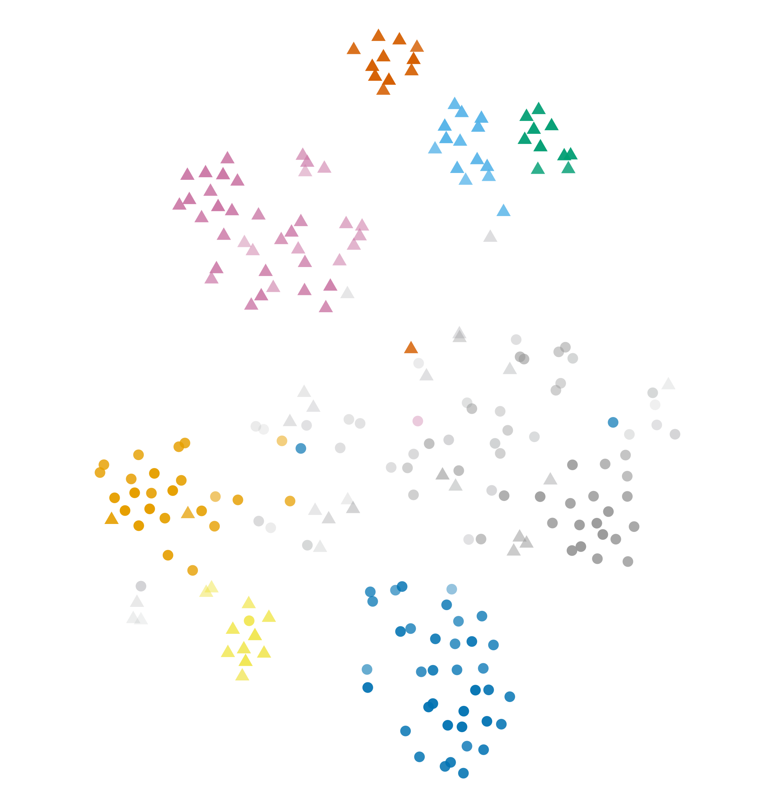
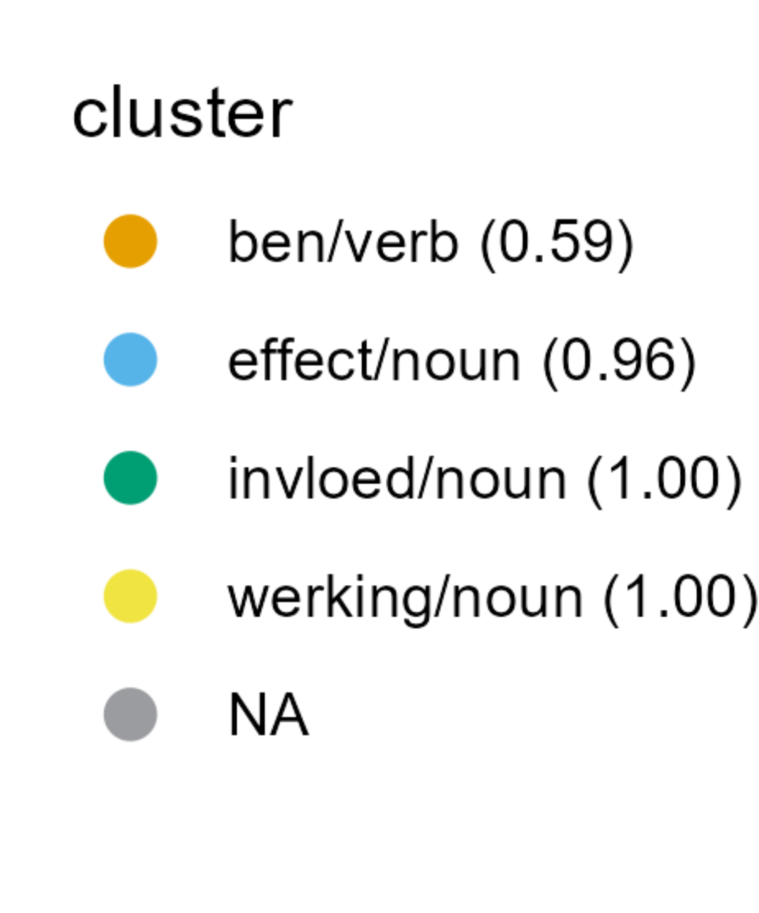
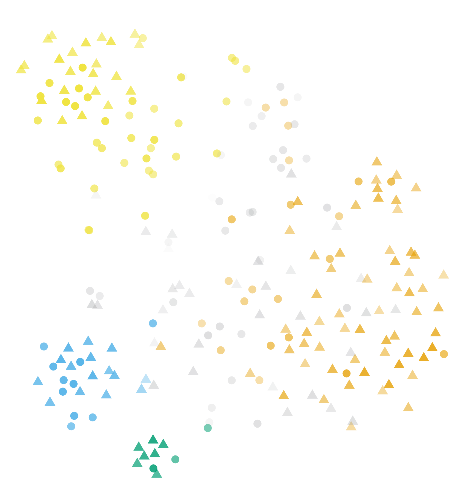
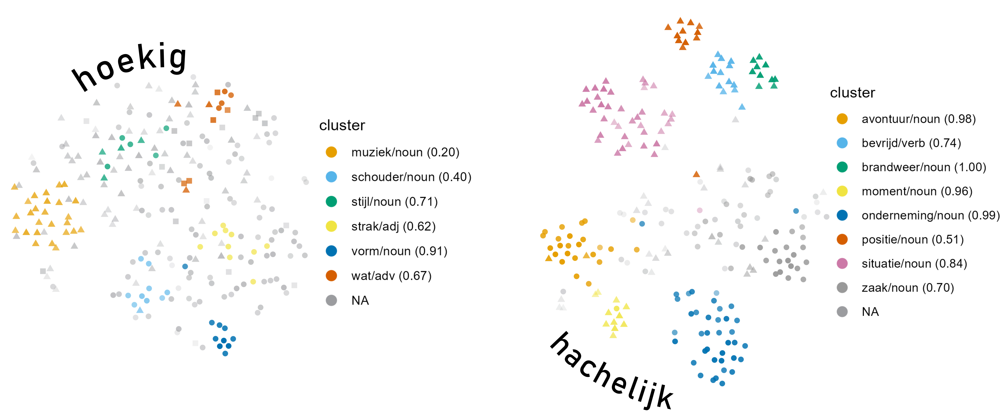
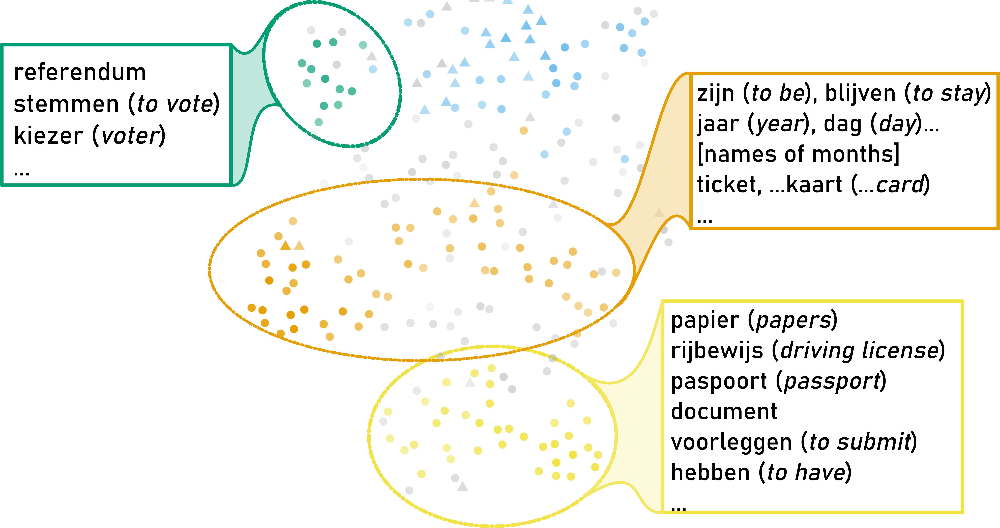

class: title-slide

```{r xaringanthemer, include=FALSE, warning=FALSE}
options(htmltools.dir.version = FALSE, readr.show_col_types = FALSE,
        knitr.kable.NA = 0)

library(xaringanthemer)
library(knitr); library(tidyverse)
library(icons)
library(kableExtra)
source(here::here("R", "scales.R"))

knitr::opts_chunk$set(
  # fig.height = 10
)

my_blue <- "#0266a0ff"
style_mono_accent(
  base_color = my_blue,
  colors = c(
    white = "#FFFFFF",
    gray = "#A9A9A9"
  ),
  title_slide_background_image = "img/cover.png",
  title_slide_background_color = "#FFFFFF",
  title_slide_text_color = my_blue
  )
down_arrow <- icon_style(fontawesome("angle-double-down"), fill = my_blue)
book <- icon_style(fontawesome("book"), fill = my_blue)
code <- icon_style(fontawesome("code"), fill = my_blue)

outline_highlight <- 0
printOutline <- function() {
    outline <- c(
    "Distributional semantics and cognitive semantics",
    "Setup",
    "Findings",
    "Summary"
  )

  if (outline_highlight > 0) {
    outline[[outline_highlight]] <- sprintf("**%s**", outline[[outline_highlight]])
    if (outline_highlight > 1) {
      for (i in 1:(outline_highlight-1)) {
        outline[[i]] <- sprintf(".gray[%s]", outline[[i]])
      }
    }
  }
  walk(paste("- ", outline, "\n\n"), cat)
  outline_highlight <<- outline_highlight + 1
}
level <- 1
printInsights <- function() {
  insights <- c(
  'Frequent context words are not always "relevant" context words.',
  'Semantic distinctiveness is not contextual distinctiveness.',
  # 'Clusters can be described by both presence and absence of context words.',
  'Clusters may correspond to prototypical patterns within a sense and even highlight specific facets of the sense.'
  )
  
  if (level == 1) {
    cat(sprintf('-  **%s** \n\n', insights[[level]]))
  } else if (level > length(insights)) {
    walk(paste('- ', insights, '\n\n'), cat)
  } else {
    walk(paste('- ', insights[1:level-1], '\n\n'), cat)
    cat(sprintf('-  **%s** \n\n', insights[[level]]))
  }
  level <<- level + 1
}

```

```{r xaringanExtra, eval=require("xaringanExtra"), echo=FALSE, warning=FALSE}
library(xaringanExtra)
use_panelset()
#use_animate_css()
use_logo(
  image_url = "../icons/cloud-qlvl-blue.png",
  width = "90px",
  link_url = "https://www.arts.kuleuven.be/ling/qlvl/projects/current/nephological-semantics"
)
use_tachyons()
use_share_again()
use_animate_css()
```

```{r metathis, echo=FALSE, warning=FALSE}
library(metathis)
meta() %>%
  meta_name("github-repo" = "montesmariana/maxipresentation") %>% 
  meta_social(
    title = "How vector space models disambiguate adjectives",
    description = paste(
      "Talk at the German Cognitive Linguistics Conference; Online, March 2022."
    ),
    url = "https://montesmariana.github.io/maxipresentation/adjectives/",
    image = "https://montesmariana.github.io/maxipresentation/adjectives/social-card.png",
    image_alt = paste(
      "Scattered scatter plots on a white background surrounding the title and author of a presentation: 'How vector space models disambiguate adjectives', by Mariana Montes and Dirk Geeraerts. On the left side, a group of points in light blue, green and yellow are surrounded by a circle of dashed lines. A larger circle, linked to it simulating a magnifying glass, stands on top of the scatterplot. Inside it has a snippet of a concordance view with the Dutch adjective 'hachelijk' on focus on the three colors and fragments of contexts to either side of the word."
    ),
    og_type = "website",
    og_author = "Mariana Montes",
    twitter_card_type = "summary_large_image",
    twitter_creator = "@roblerobusto"
  )
```

.measure.mytitle[
# `r rmarkdown::metadata$title`

## `r rmarkdown::metadata$subtitle`

**`r rmarkdown::metadata$author`**

`r rmarkdown::metadata$institute` 

]

---
layout: true

.date-footnote[DGKL-Erfurt, 02/02/2022]

---

# Outline

```{r, echo = FALSE, results="asis"}
printOutline()
```

---

# Outline

```{r, echo = FALSE, results="asis"}
printOutline()
```

---

## Distributional semantics

.bg-dark-blue.b--dark-blue.ba.bw2.br3.shadow-5.mh5.center.white[
.b[Distributional Hypothesis]: Words with similar distribution are semantically similar.
]

<br>

**Similar distribution**: attested (with similar frequency) in similar circumstances.

Can we use frequency information to represent semantic relationships?

.footnote[
`r book` Firth (1957), Harris (1954)
]


---

name: vsm-intro

## What are vector space models?

.center[**word vectors** &rarr; numerical representations of words]

```{r echo=FALSE}
tozero <- function(x) if (is.na(x) | x < 0) return(0) else return(x)

vex <- read_csv("data/vectorexample.csv", show_col_types = F) %>%
  select(target, `language/n`, `word/n`, `english/j`, `speak/v`, everything()) %>% 
  mutate(across(where(is.numeric), round, 2)) %>% 
  mutate(across(where(is.numeric), map_dbl, tozero))

kable(slice(vex, 1))
```

--

<br> 

$$PPMI_{(\mathrm{linguistics}, \mathrm{language})} = \max(0, \log\frac{p(\mathrm{linguistics}, \mathrm{language})}{p(\mathrm{linguistics})p(\mathrm{language})})$$

.footnote[
`r fontawesome("info-circle")`
Actual values from GloWbE (Global Web-based English corpus), with a window-span of 10 words to either side.

(P)PMI: [Pointwise Mutual information](https://en.wikipedia.org/wiki/Pointwise_mutual_information)

`r book` Church & Hanks (1989)
]

---
name: type-level

## Type level vectors

- Each row is the vector of a word
   - aggregating over all its occurrences

- Each column is a context feature

- Values are PPMI
  
```{r echo=FALSE, eval=require("kableExtra")}
kbl(vex, escape=FALSE)
```

---
name: study-tokens

## Token level vectors

### Tokens of *to study*

(1) Would you like to **study** linguistics?

(2) They **study** this in computational linguistics too.

(3) I eat chocolate while I **study**.

<hr>

--

.center[(1) Would you like to **study** *linguistics*?]

```{r, echo=FALSE, eval=require("kableExtra")}
vex %>% filter(target == "linguistics/n") %>%
  rename(`context feature` = target) %>% kbl()
```

.footnote[
`r book`
Schütze (1998), Heylen *et al.* (2015)
]

---
template: study-tokens

.center[(2) They **study** this in *computational linguistics* too.]

```{r, echo=FALSE, eval=require("kableExtra")}
vex %>%
  filter(target %in% c("linguistics/n", "computational/j")) %>%
  rename(`context feature` = target) %>% kbl()
```

---

### Merging vectors

.center[(2) They **study** this in *computational linguistics* too.]

```{r, echo=FALSE, eval=require("kableExtra")}
vex %>%
  filter(target %in% c("linguistics/n", "computational/j")) %>%
  rename(`context feature` = target) %>% kbl()
```

<br>

.center[
`r down_arrow`
`r down_arrow`
`r down_arrow`
`r down_arrow`
`r down_arrow`
]

<br>

```{r, echo=FALSE, eval=require("kableExtra")}
s2 <- vex %>%
  filter(target %in% c("linguistics/n", "computational/j")) %>%
  select(-target) %>% colSums() %>% as_tibble_row() %>% 
  mutate(target = "study<sub>2</sub>") %>% 
  select(target, everything())
kbl(s2, escape=FALSE)

```

---

### Token level vectors

.center[
.bb.b--gold.shadow-1.pv1.ph2[.gold.b[(1)] Would you like to **study** *linguistics*?]

<br>
.bb.b--light-blue.shadow-1.pv1.ph2[.light-blue.b[(2)] They **study** this in *computational linguistics* too.]

<br>
.bb.b--green.shadow-1.mt4.pv1.ph2[.green.b[(3)] I eat *chocolate* while I **study**.]

]

<br>

.center[
```{r, echo=FALSE, eval=require("kableExtra")}
tokens <- read_csv("data/tokensexample.csv", show_col_types = F) %>%
  kbl(escape = FALSE)

tokens %>% column_spec(1, color = palette_OkabeIto[1:3], bold=TRUE)
```
]


---

.pull-left[

#### Original text

.gold.b[(1)] Would you like to **study** *linguistics*?

.light-blue.b[(2)] They **study** this in *computational linguistics* too.

.green.b[(3)] I eat *chocolate* while I **study**.

]


.pull-right[
#### Token-context matrix

```{r, echo=FALSE, eval=require("kableExtra")}
tokens %>% 
  kable_styling(font_size = 11) %>% 
  column_spec(1, color = palette_OkabeIto[1:3], bold=TRUE)
```

]

--

.pull-left.dist[

#### Token-token distance matrix
```{r, echo=FALSE, eval=require("kableExtra")}
tdist <- read_csv("data/tokendist.csv", show_col_types = F) %>% 
  select(token, everything()) %>% 
  mutate_if(is.numeric, ~round(1-.x, 3)) %>% 
  mutate_if(is.numeric, ~cell_spec(.x, color = if_else(.x == 0, "grey", "black")))
colnames(tdist) <- c("target", tdist$token)
kbl(tdist, escape = FALSE) %>% 
  column_spec(1, color = palette_OkabeIto[1:3], bold=TRUE)
```
]

--
.pull-right[
#### t-SNE visualization

]

.footnote[
`r book`
van der Maaten & Hinton (2008)
`r code` `nephosem` (QLVL 2021), `Rtsne` (Krijthe 2015)
]

---

## Distributional semantics and cognitive semantics

.pull-left[

- Usage based method

- Bottom-up identification of patterns

- Non discrete categories

]

.pull-right[

]

.footnote[
.measure[
`r book` Campello *et al.* (2013)
`r code` `dbscan` (Hahsler & Piekenbrock 2021);
`NephoVis` (Montes & Wielfaert 2021); `shiny` (Chang *et al.* 2021)]

]

---

# Outline

```{r, echo = FALSE, results="asis"}
printOutline()
```

---

.pull-left[

## Materials

- Corpus of Dutch and Flemish Newspapers

    + 520MW
    
    + 1990-2004
    
- From 13 different adjectives, 240-320 random occurrences

- Manual annotation based on dictionary senses

- About 200 models combining different parameter settings

]

--

.pull-right[

## Examples

- *heilzaam* 'healthy/beneficial'

- *hachelijk* 'dangerous/critical'

- *hoekig*

    - 'angular' with physical objects, e.g. *wolkenkrabber* 'skyscraper'
    
    - 'broken' with rhythms and movements
    
- *geldig* 'valid'

    - based on rules, e.g. 'valid passport'
    
    - more general sense, e.g. 'valid reasoning'

]

---

## Starting points

.pull-left[

### Some assumptions

- Modified noun as:

    - typically close to the adjective

    - more salient than other context features

    - indicative of the sense of the adjective

- The more different the semantic categories of the noun, the easier it should be to model the adjective.
]

--

.pull-right[

### Examples

- *hoekig* and *geldig* should be easy to model because of the clear categories of its nouns

- *hachelijk* would be harder to model; even human annotators had some issues

- the categories of the nouns for *heilzaam* may be less clear but the health/non-health context should be

]


---

# Outline

.pull-left[

```{r, echo = FALSE, results="asis"}
printOutline()
```

]

--
.pull-right[
.bg-dark-blue.b--dark-blue.ba.bw2.br3.shadow-5.mh5.center.white[
Distributional patterns and semantic categories are different things.
]

- Modified noun &ne; predicated entity

- Distributional distinctiveness &ne; semantic distinctiveness

- Internal sense structure

]

---

## Modified noun &ne; predicated entity `r emo::ji('thinking_face')`

--

- Dictionary examples of *heilzaam*: *heilzame drank* 'healthy drink', *heilzame raad* 'good advice'

--

- Only half the examples covered by such constructions

---

.sidetitle[
### Heilzaam
]

.left-column[

<br>

.center[]
]

.right-column[
.center[]
]

---

.sidetitle[
### Heilzaam
]

.center[]

---

### Insights

```{r, echo = FALSE, results="asis"}
printInsights()
```


???

- The clusters of *heilzaam* do not discriminate the dictionary senses.

- Instead, they identify typical constructions:

    + with different, frequent context words meaning 'effect/influence';
    
    + predicative and attributive constructions without the bridging noun.

---

## Distributional distinctiveness &ne; semantic distinctiveness `r emo::ji('scream')`

- The senses of *hoekig* are clearly distinguished by the kinds of modified nouns:

    + physical objects for *angular* (*hoekige wolkenkrabber* 'angulous skyscraper')
    
    + movements, rhythms for *not-fluid* (*hoekige dans* 'broken dance')
    
    + people for a third, infrequent sense
    
- The senses of *hachelijk* occur with less distinct entities:

    + states/situations that can be dangerous (potentially, in the future)
    
    + currently dangerous/critical states/situation

--

- Human annotators have higher agreement with *hoekig* than with *hachelijk*
--
 but contextual patterns are more clear with *hachelijk* than with *hoekig*.

---


.sidetitle[
### Hachelijk & hoekig
]

.center[

<br><br>


]

---

### Insights

```{r, echo = FALSE, results="asis"}
printInsights()
```


???

- Clear semantic categories may not have distinctive contextual patterns.

- Similarity of infrequent context words may not be enough.

---

## Internal sense structure `r emo::ji('monocle')`

- Clusters may be dominated by **groups of similar context words**, such as *muziek* 'music', *klinken* 'to sound', *ritme* 'rhythm', *gitaar* 'guitar'...

- In *geldig*, the 'valid because of a rule' sense (e.g. 'valid passport') is much more frequent than the general sense (e.g. 'valid argument')

- Clusters are formed within the most frequent sense, highlighting specific facets.

---

.sidetitle[
### Geldig
]

.center[]

---

### Insights

```{r, echo = FALSE, results="asis"}
printInsights()
```


???

- Within the majority sense of 'valid because of a rule', we have:

    + focus on votes that are valid at the time of submission (*geldig uitgebrachte stemmen* 'valid submitted votes');
    
    + focus on the price and duration of tickets and transport-related cards (*de kaart is geldig voor een periode van vijf jaar* 'the card is valid for a period of five years');
    
    + focus on the possession and submission of valid identity documents (*hij kon geen geldig rijbewijs voorleggen* 'he couldn't produce a valid driving license').


---

# Outline

```{r, echo = FALSE, results="asis"}
printOutline()
```

---

# Summary

```{r, echo = FALSE, results="asis"}
printInsights()
```

--

.bg-dark-blue.b--dark-blue.ba.bw2.br3.shadow-5.mh5.center.white[
Distributional models show usage patterns, but their actual correspondence to semantic categories is
.b[an empirical question.]
]

---

# Summary

Token-level distributional models for polysemy studies are a *hachelijke* 'perilous' but *geldig* 'valid' enterprise:

- We cannot rely blindly on the clustering to replace semantic annotation:

    + clusters can represent parts of senses or be semantically heterogeneous
    
    + distributional distinctiveness does not map to semantic distinctiveness

- but they are still a rich source of insight:

    + relative weight of patterns
    
    + relationships between patterns
    
    + discovery of relevant facets via distributional patterns
    


.footnote[

`r book` Montes (2021)

]

---
layout: false
class: title-slide

.mythanks[

# Thank you!

[mariana.montes@kuleuven.be](mailto:mariana.montes@kuleuven.be)

`r icon_style(fontawesome("external-link-alt"), fill="#0266a0")` [https://slides.montesmariana.me/adjectives](https://slides.montesmariana.me/adjectives)
]

---

# References &mdash; `r book`

.f6[
Campello, Ricardo J. G. B., Davoud Moulavi & Joerg Sander. 2013. Density-Based Clustering Based on Hierarchical Density Estimates. In Jian Pei, Vincent S. Tseng, Longbing Cao, Hiroshi Motoda & Guandong Xu (eds.), *Advances in Knowledge Discovery and Data Mining*, 160–172. Berlin, Heidelberg: Springer.

Church, Kenneth Ward & Patrick Hanks. 1989. Word association norms, mutual information, and lexicography. In ACL ’89: *Proceedings of the 27th annual meeting on Association for Computational Linguistic*, 76–83. Association for Computational Linguistics.

Firth, John Rupert. 1957. A synopsis of linguistic theory 1930-1955. In John Rupert Firth (ed.), *Studies in Linguistic Analysis*, 1–32. Oxford: Blackwell.

Harris, Zellig S. 1954. Distributional structure. *Word.* 10(2–3). 146–162.

Heylen, Kris, Thomas Wielfaert, Dirk Speelman & Dirk Geeraerts. 2015. Monitoring polysemy: Word space models as a tool for large-scale lexical semantic analysis. *Lingua 157*. 153–172.

Kaufman, Leonard & Peter J. Rousseeuw. 1990. Partitioning Around Medoids (Program PAM). In *Finding Groups in Data: An Introduction to Cluster Analysis*, 68–125. Hoboken, NJ, USA: John Wiley & Sons, Inc.

Maaten, L.J.P. van der & G.E. Hinton. 2008. Visualizing high-dimensional data using t-SNE. *Journal of Machine Learning Research 9*. 2579–2605.

Montes, Mariana. 2021. *Cloudspotting: visual analytics for distributional semantics*. Leuven: KU Leuven PhD Dissertation.

Schütze, Hinrich. 1998. Automatic Word Sense Discrimination. *Computational Linguistics 24*(1). 97–123.
]

---

# Code &mdash; `r code`

.f6[
Chang, Winston, Joe Cheng, JJ Allaire, Carson Sievert, Barret Schloerke, Yihui Xie, Jeff Allen, Jonathan McPherson, Alan Dipert & Barbara Borges. 2021. shiny: Web application framework for r. Manual. https://shiny.rstudio.com/.

Hahsler, Michael, Matthew Piekenbrock & Derek Doran. 2019. dbscan: Fast density-based clustering with R. Journal of Statistical Software 91(1). 1–30. https://doi.org/10.18637/jss.v091.i01.

Krijthe, Jesse. 2018. Rtsne: T-distributed stochastic neighbor embedding using a barnes-hut implementation. https://github.com/jkrijthe/Rtsne.

Montes, Mariana & Thomas Wielfaert. 2021. QLVL/NephoVis: Altostratus. Zenodo. https://doi.org/10.5281/ZENODO.5116843.

QLVL. 2021. nephosem. Zenodo. https://doi.org/10.5281/ZENODO.5710426.
]

-----

*If you want to apply this methodology, you can find the python code [here](https://montesmariana.github.io/semasioFlow/tutorials/createClouds.html) and the R code [here](https://montesmariana.github.io/semcloud/articles/processClouds.html) (they are used in sequence); the github repository for the [Shiny App](https://marianamontes.shinyapps.io/Level3/), which combines HDBSCAN output, is [here](https://github.com/montesmariana/Level3). The repository for the visualization tool is [here](https://github.com/qlvl/NephoVis)*.