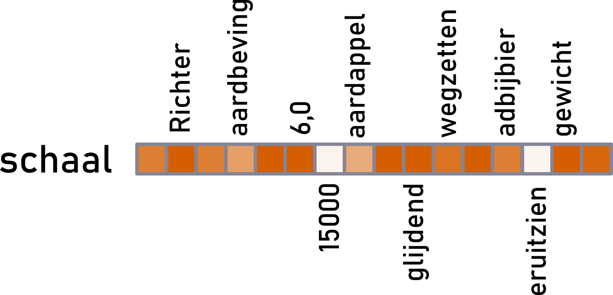
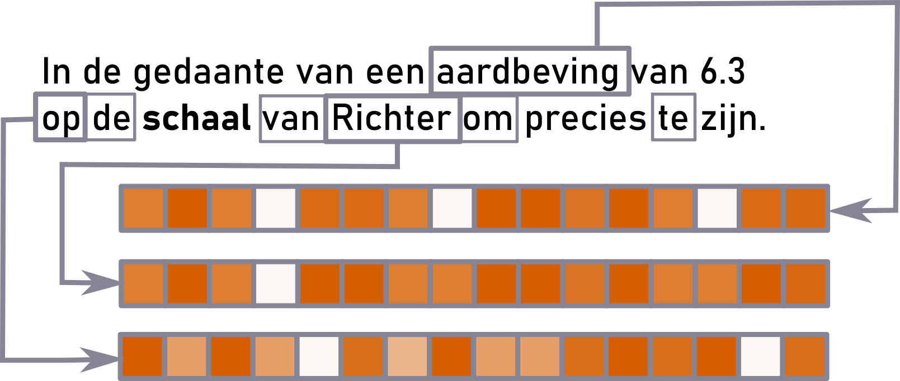
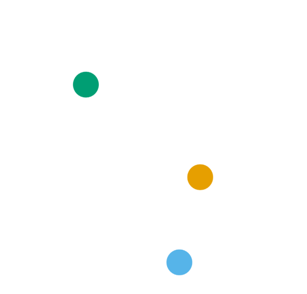

class: title-slide

```{r xaringanthemer, include=FALSE, warning=FALSE}
options(htmltools.dir.version = FALSE, readr.show_col_types = FALSE,
        knitr.kable.NA = 0, digits = 3)

library(xaringanthemer)
library(knitr); library(tidyverse)
library(icons)
library(kableExtra)
library(here)
source(here("R", "scales.R"))
library(cowplot)

knitr::opts_chunk$set(
  warning = FALSE, echo = FALSE
  # fig.height = 10
)

my_blue <- "#0266a0ff"
style_mono_accent(
  base_color = my_blue,
  colors = c(
    white = "#FFFFFF",
    gray = "#A9A9A9"
  ),
  title_slide_background_image = "img/cover.png",
  title_slide_background_color = "#FFFFFF",
  title_slide_text_color = my_blue
  )
down_arrow <- icon_style(fontawesome("angle-double-down"), fill = my_blue)
book <- icon_style(fontawesome("book"), fill = my_blue)
code <- icon_style(fontawesome("code"), fill = my_blue)
```

```{r xaringanExtra, eval=require("xaringanExtra"), echo=FALSE, warning=FALSE}
library(xaringanExtra)
use_panelset()
#use_animate_css()
use_logo(
  image_url = "../icons/cloud-qlvl-blue.png",
  width = "90px",
  link_url = "https://www.arts.kuleuven.be/ling/qlvl/projects/current/nephological-semantics"
)
use_tachyons()
use_share_again()
use_animate_css()
```

```{r metathis, echo=FALSE, warning=FALSE}
library(metathis)
meta() %>%
  meta_name("github-repo" = "montesmariana/maxipresentation") %>% 
  meta_social(
    title = "How do vector space models deal with homonymy and polysemy?",
    description = paste(
      "Talk at the Spanish Cognitive Linguistics Conference; Logroño, June 2022."
    ),
    url = "https://montesmariana.github.io/maxipresentation/aelco/",
    image = "https://montesmariana.github.io/maxipresentation/aelco/social-card.png",
    image_alt = paste(
      "Scattered scatter plots on a white background surrounding the title and author of a presentation: 'How do vector space models deal with homonymy and polysemy?', by Mariana Montes and Dirk Geeraerts. On the left side, a group of points in dark red are surrounded by a circle of dashed lines. A larger circle, linked to it simulating a magnifying glass, stands below the scatterplot. Inside it has a snippet of a concordance view with the Dutch noun 'schaal' on focus in red and fragments of contexts to either side of the word, highlighting the occurrence of 'op de schaal van Richter'."
    ),
    og_type = "website",
    og_author = "Mariana Montes",
    twitter_card_type = "summary_large_image",
    twitter_creator = "@roblerobusto"
  )
```

```{r functions, include = FALSE, code=readLines("R/run.R")}
```

```{r, include = FALSE}
medoid <- d[[5]]
```


.measure.mytitle[
# `r rmarkdown::metadata$title`

## `r rmarkdown::metadata$subtitle`

**`r rmarkdown::metadata$author`**

`r rmarkdown::metadata$institute` 

]

---
layout: true

.date-footnote[AELCO &mdash; Logroño, 29/06/2022]

---

# A model of *schaal*

.center[

]

---

# A model of *schaal*

.pull-left[
```{r}
plotCoords(d[[5]], legend_position = "none") + 
  geom_label_repel(
    data = filter(schaal5_examples, code == "schaal_1"),
    aes(label = ctxt, segment.color = cluster,
        fill = cluster),
    ylim = c(-30, -23),
    segment.size = 1, size = 6,
    segment.shape = -1, force = 0.1,
    segment.curvature = -0.6,
    color = 'white', label.padding = 0.5) +
  scale_fill_OkabeIto(aesthetics = 'segment.color', darken = 0.1, guide = 'none', drop=FALSE)
```
]
--
.pull-right[


]

---

```{r, include=FALSE, eval=require("kableExtra")}
tokens <- read_csv("data/tokensexample.csv", show_col_types = F) %>%
  kbl(escape = FALSE)
```

.pull-left[

#### Original text

.gold.b[(1)] Would you like to **study** *linguistics*?

.light-blue.b[(2)] They **study** this in *computational linguistics* too.

.green.b[(3)] I eat *chocolate* while I **study**.

]

.pull-right[
#### Token-context matrix

```{r, echo=FALSE, eval=require("kableExtra")}
tokens %>% 
  kable_styling(font_size = 16) %>% 
  column_spec(1, color = palette_OkabeIto[1:3], bold=TRUE)
```

]

--

.pull-left.dist[

#### Token-token distance matrix
```{r, echo=FALSE, eval=require("kableExtra")}
tdist <- read_csv("data/tokendist.csv", show_col_types = F) %>% 
  select(token, everything()) %>% 
  mutate_if(is.numeric, ~round(1-.x, 3)) %>% 
  mutate_if(is.numeric, ~cell_spec(.x, color = if_else(.x == 0, "grey", "black")))
colnames(tdist) <- c("target", tdist$token)
kbl(tdist, escape = FALSE) %>% 
  column_spec(1, color = palette_OkabeIto[1:3], bold=TRUE)
```
]

--
.pull-right[
#### t-SNE visualization

]

.footnote[
`r book`
van der Maaten & Hinton (2008)
`r code` `nephosem` (QLVL 2021), `Rtsne` (Krijthe 2015)
]

---

## Model of *schaal*

.center[
```{r, echo = FALSE}
plotCoords(medoid, legend_position = "none")
```
]
???
318 tokens

---
layout: false
class: title-slide

.myh.center[

# Manually annotated <br> senses

]

---

## Senses of *schaal*

**Schaal 1**

- Range (*The scale of Richter*, *a scale from 1 to 10*)

- Ratio (*The scale of a map, 1:100*)

- Magnitude (*On a large scale*)

**Schaal 2**

- Plate, dish

- Plate of a weighting instrument

---

## (Measuring) range

.pull-left[
```{r, echo = FALSE}
plotCoords(medoid, legend_position = "none", highlight_sense = "schaal_1")
```
]

.pull-right[

- `r schaal_frequencies[["schaal_1"]]` tokens

**Example**

`r schaal5_orig[["schaal_1"]]`

`r schaal5_translation[["schaal_1"]]`

]


---

## Size ratio

.pull-left[
```{r, echo = FALSE}
plotCoords(medoid, legend_position = "none", highlight_sense = "schaal_2")
```
]

.pull-right[

- `r schaal_frequencies[["schaal_2"]]` tokens

**Example**

`r schaal5_orig[["schaal_2"]]`

`r schaal5_translation[["schaal_2"]]`

]

---

## Magnitude

.pull-left[
```{r, echo = FALSE}
plotCoords(medoid, legend_position = "none", highlight_sense = "schaal_3")
```
]

.pull-right[

- `r schaal_frequencies[["schaal_3"]]` tokens

**Example**

`r schaal5_orig[["schaal_3"]]`

`r schaal5_translation[["schaal_3"]]`

]

---

## Plate

.pull-left[
```{r, echo = FALSE}
plotCoords(medoid, legend_position = "none", highlight_sense = "schaal_5")
```
]

.pull-right[

- `r schaal_frequencies[["schaal_5"]]` tokens

**Example**

`r schaal5_orig[["schaal_5"]]`

`r schaal5_translation[["schaal_5"]]`

]

---

## Plate of weighting instrument

.pull-left[
```{r, echo = FALSE}
plotCoords(medoid, legend_position = "none", highlight_sense = "schaal_6")
```
]

.pull-right[

- `r schaal_frequencies[["schaal_6"]]` tokens

**Example**

`r schaal5_orig[["schaal_6"]]`

`r schaal5_translation[["schaal_6"]]`
]

---
layout: false
class: title-slide

.myh[

# Automatic clustering

]


---


## Cluster 1

.pull-left[
```{r}
plotCoords(medoid, legend_position = "none", highlight_cluster = 1)
```
]

.pull-right[

```{r}
sense_barplot(1)
```

]

---

## Cluster 2

.pull-left[
```{r}
plotCoords(medoid, legend_position = "none", highlight_cluster = 2)
```
]

.pull-right[

```{r}
sense_barplot(2)
```

]

---

## Cluster 3

.pull-left[
```{r}
plotCoords(medoid, legend_position = "none", highlight_cluster = 3)
```
]

.pull-right[

```{r}
sense_barplot(3)
```

]

---

## Cluster 4

.pull-left[
```{r}
plotCoords(medoid, legend_position = "none", highlight_cluster = 4)
```
]

.pull-right[

```{r}
sense_barplot(4)
```

]

---

## Cluster 5

.pull-left[

```{r}
plotCoords(medoid, legend_position = "none", highlight_cluster = 5)
```
]

.pull-right[

```{r}
sense_barplot(5)
```

]

---

## Cluster 6

.pull-left[
```{r}
plotCoords(medoid, legend_position = "none", highlight_cluster = 6)
```
]

.pull-right[

```{r}
sense_barplot(6)
```

]

---

## Cluster 1

.pull-left[
```{r}
plotCoords(medoid, legend_position = "none", highlight_cluster = 1)
```
]

.pull-right[

### Most characteristic context words

```{r}
medoid$cws %>% 
  filter(cluster == 1) %>% 
  select(`Context word` = cw, Frequency = TP,
         Recall = recall, Precision = precision, Fscore) %>% 
  slice_head(n = 5) %>% 
  kbl(escape = FALSE) %>% 
  kable_styling(font_size = 16)
```

]

---

## Cluster 2

.pull-left[
```{r}
plotCoords(medoid, legend_position = "none", highlight_cluster = 2)
```
]

.pull-right[

### Most characteristic context words

```{r}
medoid$cws %>% 
  filter(cluster == 2) %>% 
  select(`Context word` = cw, Frequency = TP,
         Recall = recall, Precision = precision, Fscore) %>% 
  slice_head(n = 5) %>% 
  kbl(escape = FALSE) %>% 
  kable_styling(font_size = 16)
```
]

---

## Cluster 3

.pull-left[
```{r}
plotCoords(medoid, legend_position = "none", highlight_cluster = 3)
```
]

.pull-right[


### Most characteristic context words

```{r}
medoid$cws %>% 
  filter(cluster == 3) %>% 
  select(`Context word` = cw, Frequency = TP,
         Recall = recall, Precision = precision, Fscore) %>% 
  slice_head(n = 5) %>% 
  kbl(escape = FALSE) %>% 
  kable_styling(font_size = 16)
```
]

---

## Cluster 4

.pull-left[
```{r}
plotCoords(medoid, legend_position = "none", highlight_cluster = 4)
```
]

.pull-right[

### Most characteristic context words

```{r}
medoid$cws %>% 
  filter(cluster == 4) %>% 
  select(`Context word` = cw, Frequency = TP,
         Recall = recall, Precision = precision, Fscore) %>% 
  slice_head(n = 5) %>% 
  kbl(escape = FALSE) %>% 
  kable_styling(font_size = 16)
```
]

---

## Cluster 5

.pull-left[

```{r}
plotCoords(medoid, legend_position = "none", highlight_cluster = 5)
```
]

.pull-right[

### Most characteristic context words

```{r}
medoid$cws %>% 
  filter(cluster == 5) %>% 
  select(`Context word` = cw, Frequency = TP,
         Recall = recall, Precision = precision, Fscore) %>% 
  slice_head(n = 5) %>% 
  kbl(escape = FALSE) %>% 
  kable_styling(font_size = 16)
```
]

---

## Cluster 6

.pull-left[
```{r}
plotCoords(medoid, legend_position = "none", highlight_cluster = 6)
```
]

.pull-right[

### Most characteristic context words

```{r}
medoid$cws %>% 
  filter(cluster == 6) %>% 
  select(`Context word` = cw, Frequency = TP,
         Recall = recall, Precision = precision, Fscore) %>% 
  slice_head(n = 5) %>% 
  kbl(escape = FALSE) %>% 
  kable_styling(font_size = 16)
```
]

---
layout: false
class: title-slide

.myh[

# Variation

]

---

## Eight representative models

.pull-left[
```{r}
plot_grid(plotlist = map(
  d[1:4], plotCoords,
  legend_position = "none", point_size = 2),
  scale = 0.9, ncol = 2
)
```
]

.pull-right[
```{r}
second_list <- map(
  d[5:8], plotCoords,
  legend_position = "none", point_size = 2)
second_list[[1]] <- second_list[[1]] +
  theme(panel.border = element_rect(color = "black", fill = NA))

plot_grid(plotlist = second_list, scale = 0.9, ncol = 2)
```
]

---

## Same tokens across models

.pull-left[
```{r}
plot_grid(plotlist = map(
  d[1:4], plotCoords,
  legend_position = "none", point_size = 2,
  highlight_sense = "schaal_3"),
  scale = 0.9, ncol = 2
)
```
]

.pull-right[
```{r}
second_list <- map(
  d[5:8], plotCoords,
  legend_position = "none", point_size = 2,
  highlight_sense = "schaal_3")
second_list[[1]] <- second_list[[1]] +
  theme(panel.border = element_rect(color = "black", fill = NA))

plot_grid(plotlist = second_list, scale = 0.9, ncol = 2)
```
]

---
layout: false
class: title-slide

.myh[

# Final thoughts

]

---

## Observations

- Most senses of *schaal* are quite well distinguished.

    + And the 'dish' homonym is close together.

- *Richter*:

    + Very well isolated sense... because it's an idiomatic expression.
    
    + It is not close to the other senses of the homonym.

### Automatic clustering

- Idiomatic expressions are identified by their collocates: *gewicht*, *Richter*... *groot*?

- Different collocates in a frequent sense may stand out (*groot*, *klein*, *Europees*...)

---
.pull-left[

## More generally

Token-level distributional models for polysemy studies return <s>**semantic**</s> **contextual** patterns:

- We cannot rely blindly on the clustering to replace semantic annotation:

    + clusters can represent parts of senses or be semantically heterogeneous
    
    + distributional distinctiveness does not map to semantic distinctiveness

- but they are still a rich source of insight:

    + relative weight of patterns
    
    + relationships between patterns
    
    + discovery of relevant facets via distributional patterns
]
.pull-right[    
.measure-narrow.br3.shadow-5.grow[
[](https://cloudspotting.marianamontes.me)
]
]

---
layout: false
class: title-slide

.mythanks[

# Thank you!

[mariana.montes@kuleuven.be](mailto:mariana.montes@kuleuven.be)

[dirk.geeraerts@kuleuven.be](mailto:dirk.geeraerts@kuleuven.be)

`r icon_style(fontawesome("external-link-alt"), fill="#0266a0")` [https://slides.montesmariana.me/aelco](https://slides.montesmariana.me/aelco)
]

---

# References &mdash; `r book`

.f6[
Campello, Ricardo J. G. B., Davoud Moulavi & Joerg Sander. 2013. Density-Based Clustering Based on Hierarchical Density Estimates. In Jian Pei, Vincent S. Tseng, Longbing Cao, Hiroshi Motoda & Guandong Xu (eds.), *Advances in Knowledge Discovery and Data Mining*, 160–172. Berlin, Heidelberg: Springer.

Church, Kenneth Ward & Patrick Hanks. 1989. Word association norms, mutual information, and lexicography. In ACL ’89: *Proceedings of the 27th annual meeting on Association for Computational Linguistic*, 76–83. Association for Computational Linguistics.

Firth, John Rupert. 1957. A synopsis of linguistic theory 1930-1955. In John Rupert Firth (ed.), *Studies in Linguistic Analysis*, 1–32. Oxford: Blackwell.

Harris, Zellig S. 1954. Distributional structure. *Word.* 10(2–3). 146–162.

Heylen, Kris, Thomas Wielfaert, Dirk Speelman & Dirk Geeraerts. 2015. Monitoring polysemy: Word space models as a tool for large-scale lexical semantic analysis. *Lingua 157*. 153–172.

Kaufman, Leonard & Peter J. Rousseeuw. 1990. Partitioning Around Medoids (Program PAM). In *Finding Groups in Data: An Introduction to Cluster Analysis*, 68–125. Hoboken, NJ, USA: John Wiley & Sons, Inc.

Maaten, L.J.P. van der & G.E. Hinton. 2008. Visualizing high-dimensional data using t-SNE. *Journal of Machine Learning Research 9*. 2579–2605.

Montes, Mariana. 2021. *Cloudspotting: visual analytics for distributional semantics*. Leuven: KU Leuven PhD Dissertation.

Schütze, Hinrich. 1998. Automatic Word Sense Discrimination. *Computational Linguistics 24*(1). 97–123.
]

---

# Code &mdash; `r code`

.f6[
Chang, Winston, Joe Cheng, JJ Allaire, Carson Sievert, Barret Schloerke, Yihui Xie, Jeff Allen, Jonathan McPherson, Alan Dipert & Barbara Borges. 2021. shiny: Web application framework for r. Manual. https://shiny.rstudio.com/.

Hahsler, Michael, Matthew Piekenbrock & Derek Doran. 2019. dbscan: Fast density-based clustering with R. Journal of Statistical Software 91(1). 1–30. https://doi.org/10.18637/jss.v091.i01.

Krijthe, Jesse. 2018. Rtsne: T-distributed stochastic neighbor embedding using a barnes-hut implementation. https://github.com/jkrijthe/Rtsne.

Sevenants, Anthe, Montes, Mariana, & Wielfaert, Thomas. (2022). NephoVis (1.1.0). Zenodo. https://doi.org/10.5281/zenodo.6629350

QLVL. 2021. nephosem. Zenodo. https://doi.org/10.5281/ZENODO.5710426.
]

-----

*If you want to apply this methodology, you can find the python code [here](https://montesmariana.github.io/semasioFlow/tutorials/createClouds.html) and the R code [here](https://montesmariana.github.io/semcloud/articles/processClouds.html) (they are used in sequence); the github repository for the [Shiny App](https://marianamontes.shinyapps.io/Level3/), which combines HDBSCAN output, is [here](https://github.com/montesmariana/Level3). The repository for the visualization tool is [here](https://github.com/qlvl/NephoVis)*.

---

# Materials

- Corpus of Dutch and Flemish Newspapers

    + 520MW
    
    + 1990-2004
    
- From 8 different nouns

    + 240-320 random occurrences
    
    + Homonyms, at least one polysemous

- Manual annotation based on dictionary senses

- About 200 models combining different parameter settings
