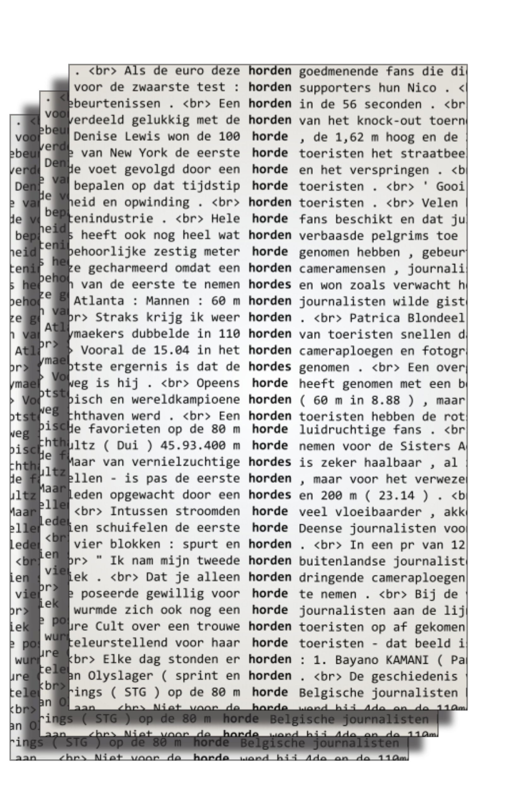
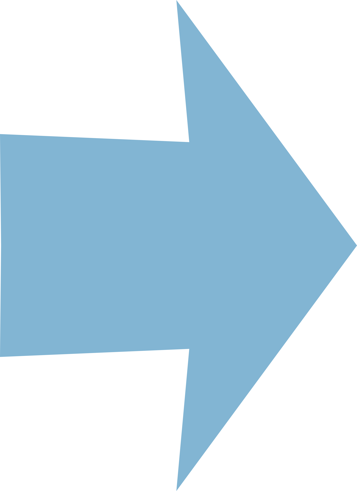
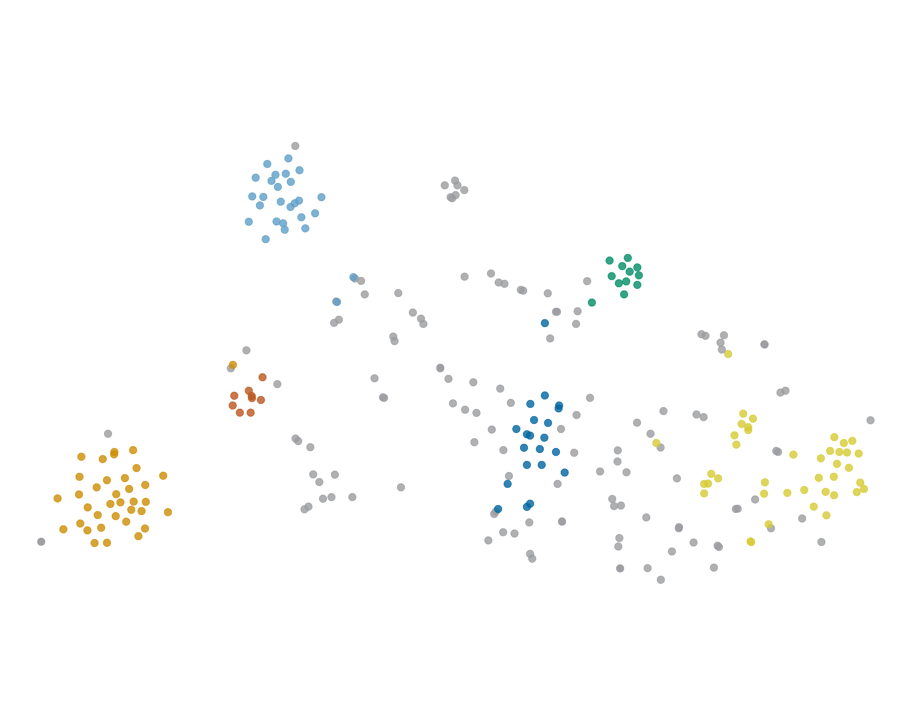
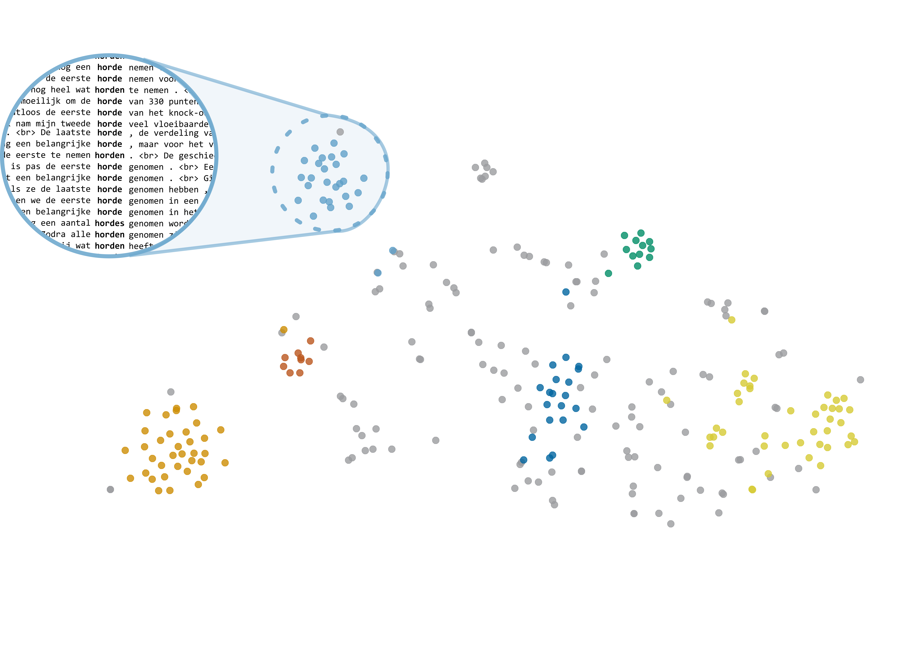
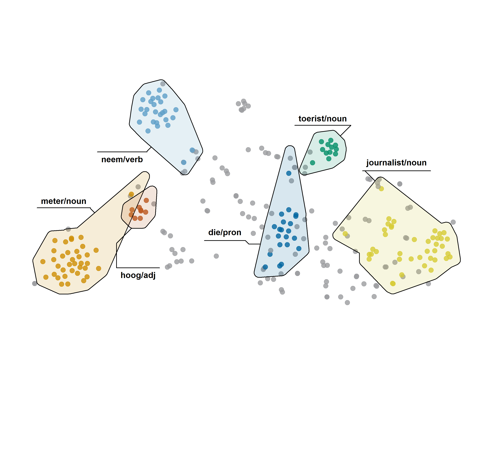

class: title-slide

```{r xaringanthemer, include=FALSE, warning=FALSE}
options(htmltools.dir.version = FALSE, readr.show_col_types = FALSE,
        knitr.kable.NA = 0)

library(xaringanthemer)
library(knitr); library(tidyverse)
library(icons)
library(kableExtra)

knitr::opts_chunk$set(
  # fig.height = 10
)

style_mono_accent(
  base_color = "#0266a0ff",
  colors = c(
    white = "#FFFFFF",
    gray = "#A9A9A9"
  ),
  title_slide_background_image = "img/cover.png",
  title_slide_background_color = "#FFFFFF",
  title_slide_text_color = "#0266a0ff"
  )
down_arrow <- icon_style(fontawesome("angle-double-down"), fill = "#0266a0")
ci <- icon_set("icons")

outline <- c(
  "What for?",
  "Distributional Semantics",
  "Visual Analytics",
  "Insights"
)


printOutline <- function(outline, highlight = double()) {
  if (length(highlight) > 0) {
    for (i in highlight) {
      outline[[i]] <- sprintf("**%s**", outline[[i]])
    }
    if (min(highlight) > 1) {
      for (i in 1:(min(highlight)-1)) {
        outline[[i]] <- sprintf(".gray[%s]", outline[[i]])
      }
    }
  }
  walk(paste("- ", outline, "\n\n"), cat)
}

```

```{r xaringanExtra, eval=require("xaringanExtra"), echo=FALSE, warning=FALSE}
library(xaringanExtra)
use_panelset()
#use_animate_css()
use_logo(
  image_url = "icons/cloud-qlvl-blue.png",
  width = "90px",
  link_url = "https://www.arts.kuleuven.be/ling/qlvl/projects/current/nephological-semantics"
)
use_tachyons()
use_share_again()
use_animate_css()
```

```{r metathis, echo=FALSE, warning=FALSE}
library(metathis)
meta() %>%
  meta_name("github-repo" = "montesmariana/maxipresentation") %>% 
  meta_social(
    title = "Cloudspotting. Visual Analytics for Distributional Semantics",
    description = paste(
      "Public doctoral defense, 21 September 2021"
    ),
    url = "https://montesmariana.github.io/maxipresentation/cloudspotting.html",
    image = "https://montesmariana.github.io/maxipresentation/cloudspotting.png",
    image_alt = paste(
      "Cloudspotting:", 
      "Visual Analytics for Distributional Semantics", 
      "Doctoral defense, Mariana Montes."
    ),
    og_type = "website",
    og_author = "Mariana Montes",
    twitter_card_type = "summary_large_image",
    twitter_creator = "@roblerobusto"
  )
```
```{r sourcecode, include=FALSE, code=readLines("R/presentations.R")}
```

.measure.mytitle[
# `r rmarkdown::metadata$title`

## `r rmarkdown::metadata$subtitle`

**`r rmarkdown::metadata$author`**

`r rmarkdown::metadata$institute` 

]

---
layout: true

.date-footnote[Leuven, 21/09/2021]

---

# Outline

```{r, echo = FALSE, results="asis"}
printOutline(outline)
```

---

# Outline

```{r, echo = FALSE, results="asis"}
printOutline(outline, 1)
```

---

# Introduction

.bg-lightest-blue.b--dark-blue.ba.bw2.br3.shadow-5.center[
Using distributional semantics for semasiological research
]
<br>
--

.fl.w-third.center.ph2.pv2[

]

--

.fl.w-third.center.ph2.pv2[

]

--

.fl.w-third.center.ph2.pv2[


]


???

Image credits.
Dictionary foto: Joshua Hoehne on Unsplash (https://unsplash.com/@mrthetrain)

Writing foto: Kat Stokes on Unsplash (https://unsplash.com/@katstokes_)

---
class: hide_logo

.fl.w-third.ph1[

]
--
.fl.w-third.ph1[

]
--
.fl.w-third.ph1[

]

---

.fl.w-40.ph3[

]

.fl.w-10.p3[
<br>

<br>

<br>


]

.fl.w-50[

]

---


.center[



]

---

# Outline

```{r, echo = FALSE, results="asis"}
printOutline(outline, 2)
```

---

## Distributional Hypothesis

.bg-dark-blue.b--dark-blue.ba.bw2.br3.shadow-5.mh5.center.white[
Words with similar distribution are semantically similar.
]

<br>

**Similar distribution**: attested (with similar frequency) in similar circumstances.

Can we use frequency information to represent semantic relationships?

---

name: vsm-intro

## What are vector space models?

.center[**word vectors** &rarr; numerical representations of words]

```{r echo=FALSE}
vex <- read_csv("vectorexample.csv", col_types = cols()) %>%
  select(target, `language/n`, `word/n`, `english/j`, `speak/v`, everything()) %>% 
  mutate(across(where(is.numeric), round, 2))

kable(slice(vex, 1))
```

--

<br> 

$$PMI_{(\mathrm{linguistics}, \mathrm{language})} = \log\frac{p(\mathrm{linguistics}, \mathrm{language})}{p(\mathrm{linguistics})p(\mathrm{language})}$$

.footnote[
`r fontawesome("info-circle")`
Actual values from GloWbE (Global Web-based English corpus), with a window-span of 10 words to either side.

PMI: [Pointwise Mutual information](https://en.wikipedia.org/wiki/Pointwise_mutual_information)]

---
template: vsm-intro

<br>

$$PMI_{(\mathrm{linguistics}, \mathrm{language})} = \log\frac{285/N}{\frac{20,740}{N}\frac{1.58 \times 10^6}{N}}$$
---

template: vsm-intro

<br>

$$PMI_{(\mathrm{linguistics}, \mathrm{language})} = \log\frac{285}{20,740\times 1.58 \times 10^6}9.14 \times 10^8 = 4.37$$
---
name: type-level

## Type level vectors

- Each row is the vector of a word
   - aggregating over all its occurrences

- Each column is a context feature

---
template: type-level

- Values are PMI

  
```{r echo=FALSE, eval=require("kableExtra")}
kbl(vex, escape=FALSE)
```

---
template: type-level

- Values are **P**PMI: negative values turned to 0.


```{r echo=FALSE, eval=require("kableExtra")}
tozero <- function(x) if (is.na(x) | x < 0) return(0) else return(x)

vex <- vex %>%
  mutate(across(where(is.numeric), map_dbl, tozero))
kbl(vex, escape=FALSE)
```

---
name: study-tokens

## Token level vectors

### Tokens of *to study*

(1) Would you like to **study** linguistics?

(2) They **study** this in computational linguistics too.

(3) I eat chocolate while I **study**.

<hr>

--

.center[(1) Would you like to **study** *linguistics*?]

```{r, echo=FALSE, eval=require("kableExtra")}
vex %>% filter(target == "linguistics/n") %>%
  rename(`context feature` = target) %>% kbl()
```

---
template: study-tokens

.center[(2) They **study** this in *computational linguistics* too.]

```{r, echo=FALSE, eval=require("kableExtra")}
vex %>%
  filter(target %in% c("linguistics/n", "computational/j")) %>%
  rename(`context feature` = target) %>% kbl()
```

---

### Merging vectors

.center[(2) They **study** this in *computational linguistics* too.]

```{r, echo=FALSE, eval=require("kableExtra")}
vex %>%
  filter(target %in% c("linguistics/n", "computational/j")) %>%
  rename(`context feature` = target) %>% kbl()
```

--
<br>

.center[
`r down_arrow`
`r down_arrow`
`r down_arrow`
`r down_arrow`
`r down_arrow`
]

<br>

```{r, echo=FALSE, eval=require("kableExtra")}
s2 <- vex %>%
  filter(target %in% c("linguistics/n", "computational/j")) %>%
  select(-target) %>% colSums() %>% as_tibble_row() %>% 
  mutate(target = "study<sub>2</sub>") %>% 
  select(target, everything())
kbl(s2, escape=FALSE)

```

---

### Token level vectors

.center[
.bb.b--gold.shadow-1.pv1.ph2[.gold.b[(1)] Would you like to **study** *linguistics*?]

<br>
.bb.b--light-blue.shadow-1.pv1.ph2[.light-blue.b[(2)] They **study** this in *computational linguistics* too.]

<br>
.bb.b--green.shadow-1.mt4.pv1.ph2[.green.b[(3)] I eat *chocolate* while I **study**.]

]

<br>

.center[
```{r, echo=FALSE, eval=require("kableExtra")}
tokens <- read_csv("tokensexample.csv", col_types = cols()) %>%
  kbl(escape = FALSE)

tokens %>% column_spec(1, color = colorblindr::palette_OkabeIto[1:3], bold=TRUE)
```
]


---

.pull-left[

#### Original text

.gold.b[(1)] Would you like to **study** *linguistics*?

.light-blue.b[(2)] They **study** this in *computational linguistics* too.

.green.b[(3)] I eat *chocolate* while I **study**.

]


.pull-right[
#### Token-context matrix

```{r, echo=FALSE, eval=require("kableExtra")}
tokens %>% 
  kable_styling(font_size = 11) %>% 
  column_spec(1, color = colorblindr::palette_OkabeIto[1:3], bold=TRUE)
```

]

--

.pull-left.dist[

#### Token-token distance matrix
```{r, echo=FALSE, eval=require("kableExtra")}
tdist <- read_csv("tokendist.csv", col_types = cols()) %>% 
  select(token, everything()) %>% 
  mutate_if(is.numeric, ~round(1-.x, 3)) %>% 
  mutate_if(is.numeric, ~cell_spec(.x, color = if_else(.x == 0, "grey", "black")))
colnames(tdist) <- c("target", tdist$token)
kbl(tdist, escape = FALSE) %>% 
  column_spec(1, color = colorblindr::palette_OkabeIto[1:3], bold=TRUE)
```
]

--
.pull-right[
#### t-SNE visualization

]

---

# Outline

```{r, echo = FALSE, results="asis"}
printOutline(outline, 3)
```

---
.center[
]

---

.center[


]

---

.center[



]

---

# Outline

```{r, echo = FALSE, results="asis"}
printOutline(outline, 4)
```

---

# Insights

- Models do represent contextual patterns.

--

- BUT they do not necessarily correspond to semantic phenomena.

--

- Their shape and strength correspond to **frequency**, **distinctiveness** and **relatedness** of the context words.

--

<hr>

Can we use the models for automatic disambiguation?

> **No**, not reliably enough.
The correspondence between patterns and senses varies per word.

--

Should we then discard distributional models altogether?

> **No**, they can still be informative.
We can learn about the *structure* itself, about the patterns and their relationships.

--

> The visualization tools will help you!


---
layout: false
class: title-slide

.mythanks[

# Thank you!

[mariana.montes@kuleuven.be](mailto:mariana.montes@kuleuven.be)

`r icon_style(fontawesome("cloud-meatball"), fill="#0266a0")` [https://qlvl.github.io/NephoVis/](https://qlvl.github.io/NephoVis/)
]