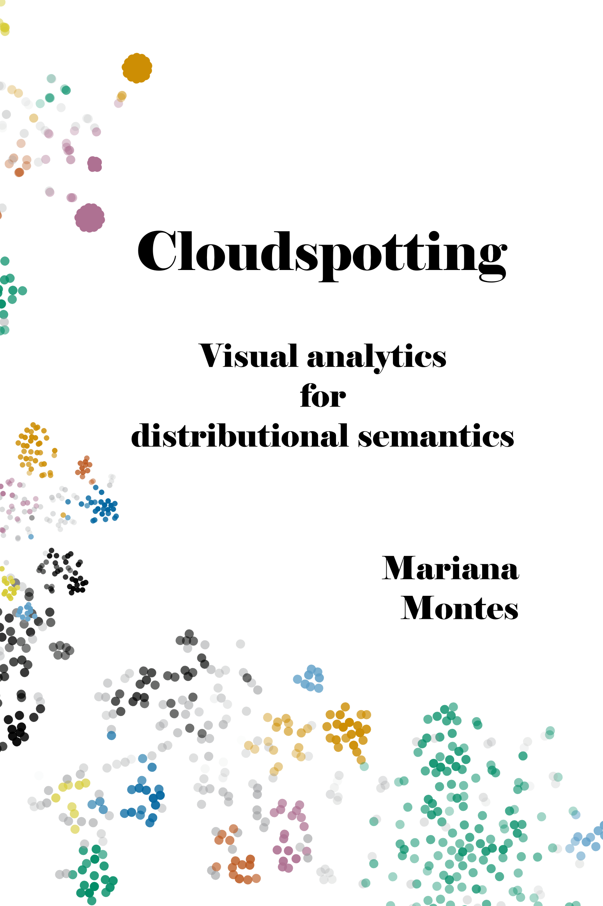

class: title-slide

```{r xaringanthemer, include=FALSE, warning=FALSE}
options(htmltools.dir.version = FALSE, readr.show_col_types = FALSE,
        knitr.kable.NA = 0)
library(xaringanthemer)
library(knitr); library(tidyverse)
library(icons)
library(kableExtra)
library(here)

my_kbl <- function(x, ...) kbl(x, ..., escape = F, format.args = list(decimal.mark = ',', drop0trailing=TRUE))


myblue <- "#0266a0ff"
style_mono_accent(
  base_color = myblue,
  colors = c(
    white = "#FFFFFF",
    gray = "#A9A9A9"
  ),
  title_slide_background_image = "img/cover.png",
  title_slide_background_color = "#FFFFFF",
  title_slide_text_color = myblue,
  outfile = 'xaringan-themer-blue.css'
  )
down_arrow <- icon_style(fontawesome("angle-double-down"), fill = myblue)
book <- icon_style(fontawesome("book"), fill = myblue)
code <- icon_style(fontawesome("code"), fill = myblue)

outline <- c(
  "Introducción",
  "Modelos distribucionales",
  "Comparación de modelos",
  "Agrupación de ocurrencias"
)

printOutline <- function(outline, highlight = double()) {
  if (length(highlight) > 0) {
    for (i in highlight) {
      outline[[i]] <- sprintf("**%s**", outline[[i]])
    }
    if (min(highlight) > 1) {
      for (i in 1:(min(highlight)-1)) {
        outline[[i]] <- sprintf(".gray[%s]", outline[[i]])
      }
    }
  }
  walk(paste("- ", outline, "\n\n"), cat)
}
```

```{r xaringanExtra, eval=require("xaringanExtra"), echo=FALSE, warning=FALSE}
library(xaringanExtra)
use_panelset()
#use_animate_css()
use_logo(
  image_url = here("icons","cloud-qlvl-blue.png"),
  width = "90px",
  link_url = "https://www.arts.kuleuven.be/ling/qlvl/projects/current/nephological-semantics"
)
use_tachyons()
use_share_again()
```

```{r metathis, echo=FALSE, warning=FALSE}
library(metathis)
meta() %>%
  meta_name("github-repo" = "montesmariana/maxipresentation") %>% 
  meta_social(
    title = "Métodos distribucionales y visualización aplicados a la semántica léxica",
    description = paste(
      "Presentación en el ciclo de charlas del Grupo de Estadística en Estudios del Lenguaje (UBA), via Zoom el 6 de noviembre de 2021."
    ),
    url = "https://montesmariana.github.io/maxipresentation/gesel/",
    image = "https://montesmariana.github.io/maxipresentation/gesel/social-card.png",
    image_alt = paste(
      "Título 'Métodos distribucionales y visualización aplicados a la semántica léxica',",
      "nombre y afiliciación de la autora, Mariana Montes, KU Leuven, en un fondo blanco con gráficos de puntos de varios colores alrededor.",
      "En uno de los gráficos, un grupo de puntos azules está rodeado por un círculo conectado a otro círculo más grande, como en efecto lupa, dentro del cual se ven líneas de texto, ejemplos de la palabra neerlandesa 'horde'."
    ),
    og_type = "website",
    og_author = "Mariana Montes",
    twitter_card_type = "summary_large_image",
    twitter_creator = "@roblerobusto"
  )
```

```{r sourcecode, include=FALSE, code=readLines("../R/presentations.R")}
```

.measure.mytitle[
# Métodos distribucionales y visualización

## aplicados a la semántica léxica

**`r rmarkdown::metadata$author`**

 

]

---
layout: true

.date-footnote[GESEL, 06/11/2021]

---

# Contenidos

```{r, echo = FALSE, results="asis"}
printOutline(outline)
```

---

# Contenidos

```{r, echo = FALSE, results="asis"}
printOutline(outline, 1)
```

---

.pull-left[
# Introducción


- Metodología y conclusiones de mi tesis doctoral

- Parte del projecto [**Semántica Nefológica**](https://www.arts.kuleuven.be/ling/qlvl/projects/current/nephological-semantics)

]

.pull-right[

.measure-narrow.br3.shadow-5.grow[
[](https://cloudspotting.marianamontes.me)
]

]

---

## Herramientas utilizadas

- `r simple_icons("python")` [Módulo de Python](https://github.com/QLVL/nephosem/) para crear espacios vectoriales

- `r simple_icons("python")` & `r simple_icons("r")` para procesar y analizar los datos

- `r simple_icons("d3dotjs")` & Shiny para crear visualizaciones interactivas en la web:
  - [Nephovis](https://qlvl.github.io/NephoVis/)
  
  - [Level 3 (Shiny app)](https://marianamontes.shinyapps.io/Level3/)


---

# Contenidos

```{r, echo = FALSE, results="asis"}
printOutline(outline, 2)
```

---

## Hipótesis distribucional

.measure-wide[
- Correspondencia/correlación entre propiedades distribucionales y propiedades semánticas

- "You shall know a word by the company it keeps" (Firth 1957:11)
]
.footnote[
`r book` Firth (1957), Harris (1954)
]

---
name: vsm-intro

## ¿Qué es un modelo distribucional?

.center[**vector** &rarr; lista de números]

```{r echo=FALSE}
vex <- read_delim("data/ejemplovectores.csv", delim = ";", locale = locale(decimal_mark = ",")) %>% 
  mutate_if(is.numeric, round, 2)

my_kbl(slice(vex, 1))
```

--

<br> 
$$PMI_{(\mathrm{lingüística}, \mathrm{lenguaje})} = \log\frac{p(\mathrm{lingüística},\mathrm{lenguaje})}{p(\mathrm{lingüística})p(\mathrm{lenguaje})}$$

.footnote[
`r fontawesome("info-circle")`
Valores originales del [Corpus del Español](https://www.corpusdelespanol.org/web-dial/) con una ventana simétrica de 4 palabras a cada lado.

PMI: [Pointwise Mutual information](https://en.wikipedia.org/wiki/Pointwise_mutual_information)
`r book` Church & Hanks (1989)
]

---
template: vsm-intro

<br>

$$PMI_{(\mathrm{lingüística}, \mathrm{lenguaje})} = \log\frac{121/N}{p(\mathrm{lingüística})p(\mathrm{lenguaje})}$$
---
template: vsm-intro

<br>

$$PMI_{(\mathrm{lingüística}, \mathrm{lenguaje})} = \log\frac{121/N}{\frac{14.587}{N}\frac{171.730}{N}}$$
---

template: vsm-intro

<br>

$$PMI_{(\mathrm{lingüística}, \mathrm{lenguaje})} = \log\frac{121}{14.587\times 171.730} N$$
---

template: vsm-intro

<br>

$$PMI_{(\mathrm{lingüística}, \mathrm{lenguaje})} = \log\frac{121}{14.587\times 171.730} N = 3,55$$
---
# ¿Qué es un modelo distribucional?

.center[**vector** &rarr; lista de números]

```{r echo=FALSE}
neg2zero <- \(x) ifelse(x <= 0 | is.na(x), 0L, x)
posvex <- vex %>% 
  mutate(across(where(is.numeric), neg2zero))

my_kbl(slice(posvex, 1))
```

<br>

$$PPMI(x) = \max(PMI(x), 0)$$
---

# Nivel de tipo: una palabra, un vector

- Cada fila es el vector de una palabra
   - agrupando datos de todas sus ocurrencias

- Cada columna es un elemento del contexto

```{r echo=FALSE}
my_kbl(posvex)
```

---
name: study-tokens

# Nivel de caso: una ocurrencia, un vector

### Ocurrencias de *estudiar*

(1) ¿Te gustaría **estudiar** el léxico del neerlandés?

(2) También **estudian** esto en lingüística computacional.

(3) Cuando **estudio** tomo mate y como chocolate.

<hr>

--

.center[(1) ¿Te gustaría **estudiar** el *léxico* del neerlandés?]

```{r, echo=FALSE}
posvex %>% filter(nodo == "léxico") %>%
  rename(contexto = nodo) %>% my_kbl()
```

.footnote[
`r book`
Schütze (1998), Heylen *et al.* (2015)
]

---
template: study-tokens

.center[(2) También **estudian** esto en *lingüística* *computacional*.]

```{r, echo=FALSE}
posvex %>%
  filter(nodo %in% c("lingüística", "computacional")) %>%
  rename(contexto = nodo) %>% my_kbl()
```

---

### Fusión de vectores

.center[(2) También **estudian** esto en *lingüística* *computacional*.]

```{r, echo=FALSE}
posvex %>%
  filter(nodo %in% c("lingüística", "computacional")) %>%
  rename(contexto = nodo) %>% my_kbl()
```

--
<br>

.center[
`r down_arrow`
`r down_arrow`
`r down_arrow`
`r down_arrow`
`r down_arrow`
]

<br>

```{r, echo=FALSE}
s2 <- posvex %>%
  filter(nodo %in% c("lingüística", "computacional")) %>%
  select(-nodo) %>% colSums(na.rm = T) %>% as_tibble_row() %>% 
  mutate(nodo = "estudiar<sub>2</sub>") %>% 
  select(nodo, everything())
my_kbl(s2)

```

---

### Vectores de casos

.center[
.bb.b--gold.shadow-1.pv1.ph2[.gold.b[(1)] ¿Te gustaría **estudiar** el *léxico* del neerlandés?]

<br>
.bb.b--light-blue.shadow-1.pv1.ph2[.light-blue.b[(2)] También **estudian** esto en *lingüística* *computacional*.]

<br>
.bb.b--green.shadow-1.mt4.pv1.ph2[.green.b[(3)] Cuando **estudio** tomo *mate* y como *chocolate*.]

]

<br>

.center[
```{r, echo=FALSE}
num2char <- \(x) format(x, decimal.mark = ',', drop0trailing=TRUE)
tokvecs <- read_delim("data/ejemplotokens.csv", delim = ";", locale = locale(decimal_mark = ",")) %>% 
  mutate(across(where(is.numeric), neg2zero))
tokvecs_char <- tokvecs %>% 
  mutate(across(where(is.numeric), num2char),
         across(-nodo, ~cell_spec(.x, color = if_else(.x == 0, 'grey', 'black'))))
alignment <- c('l', rep('r', length(tokvecs)-1)) %>% 
  paste(collapse = '')
tokdf <- tokvecs_char %>%
  my_kbl(align = alignment) %>% 
  column_spec(1, color = colorblindr::palette_OkabeIto[1:3], bold=TRUE)
tokdf
```
]

---

.pull-left[

#### Texto original

.gold.b[(1)] ¿Te gustaría **estudiar** el *léxico* del neerlandés?

.light-blue.b[(2)] También **estudian** esto en *lingüística* *computacional*.

.green.b[(3)] Cuando **estudio** tomo *mate* y como *chocolate*.

]


.pull-right[
#### Matriz entre casos y contextos

```{r, echo=FALSE}
tokdf %>% kable_styling(font_size = 14)
```

]

--

.pull-left.dist[

#### Matriz de distancias entre casos

```{r, echo=FALSE}
tokvecs_mtx <- tokvecs %>% 
  data.frame(row.names = "nodo") %>% 
  as.matrix()
tsim <- tokvecs_mtx %>% 
  t() %>% 
  lsa::cosine()
tdist <- as_tibble(1-tsim, rownames = "caso") %>% 
  mutate(across(where(is.numeric), map_chr, \(x) if (x == 0) '0' else format(x, digits = 2, decimal.mark = ','))) %>% 
  mutate(across(-caso, ~cell_spec(.x, color = if_else(.x == '0', "grey", "black"))))
colnames(tdist) <- c("caso", tdist$caso)
my_kbl(tdist, align = 'lrrr') %>% 
  kable_styling(font_size = 16) %>% 
  column_spec(1, color = colorblindr::palette_OkabeIto[1:3], bold=TRUE)
```
]

--
.pull-right[
#### t-SNE: visualización
.halfsize[

]
]

.footnote[
`r book`
van der Maaten & Hinton (2008)
`r code` `nephosem`, `Rtsne` (Krijthe 2015)
]

---

# Contenidos

```{r, echo = FALSE, results="asis"}
printOutline(outline, 3)
```

---

# Comparación de modelos

.pull-left[
- Distintas formas de definir el contexto:

  - amplitud de la ventana
  
  - filtros gramaticales
  
  - relaciones sintácticas
]

--

.pull-right[
.bg-lightest-blue.b--dark-blue.ba.bw2.br3.shadow-5.mh5.center[
Pero ninguna configuración de parámetros es óptima para todos los casos.
]
]

```{r, stof1, echo=FALSE, fig.align='center', fig.asp=0.35, out.width='70%'}
exlemmas <- c('stof', 'hoop', 'heet', 'huldigen')
cowplot::plot_grid(
  plotlist = map(exlemmas, plotTest, 'sense'), nrow=1,
  labels = exlemmas, greedy = F)
```

.footnote[
.tiny[
*stof* 'substancia, tela, polvo'; *hoop* 'esperanza, montón'; *heet* 'caliente'; *huldigen* 'sostener (una idea), homenajear'.]
]

---

## Selección de modelos representativos

.left-column[

- Distancias entre modelos

- PAM (**P**artitioning **A**round **M**edoids)

`r book` Kaufman & Rousseeuw (1990)

`r code` `cluster` (Maechler *et al.* 2021)

]

.right-column[
```{r, echo=FALSE}
knitr::include_url("https://qlvl.github.io/NephoVis/level1.html?type=heffen")
```

]

.footnote[
`r code`
`NephoVis` (Montes & Wielfaert 2021)
]

---

# Contenidos

```{r, echo = FALSE, results="asis"}
printOutline(outline, 4)
```

---

# Agrupación de ocurrencias

- HDBSCAN: **H**ierarchical **D**ensity-**B**ased **S**patial **C**lustering of **A**pplications with **N**oise

  - Método de agrupamiento jerárquico
  
  - No asume que todos los elementos deben ser agrupados
  
  - Incluye *probabilidades* de pertenencia
  
  - Busca áreas densas rodeadas de áreas menos densas
  
.footnote[

`r book` Campello *et al.* (2013)
`r code` `dbscan` (Hahsler & Piekenbrock 2021)
]
  
---

## ¿Para qué?

- Sistema automático de identificación de grupos

- Tiende a coincidir con los grupos que vemos en t-SNE (perplejidad 30) &mdash;al menos en mis datos

.panelset.w-80.center[

.panel[.panel-name[*hachelijk* 'riesgoso/crítico']

.pull-left[
```{r, hachelijk1, echo=FALSE, out.width='80%', fig.align='center'}
plotTest('hachelijk')
```

]
--
.pull-right[
```{r, hachelijk2, echo=FALSE, out.width='80%', fig.align='center'}
plotTest('hachelijk', color = 'hdbscan')
```

]
]
.panel[.panel-name[*hoop* 'esperanza/montón']

.pull-left[
```{r, hoop1, echo=FALSE, out.width='80%', fig.align='center'}
plotTest('hoop')
```

]
--
.pull-right[
```{r, hoop2, echo=FALSE, out.width='80%', fig.align='center'}
plotTest('hoop', color = 'hdbscan')
```

]
]
]

---

## Exploración: [Shiny App](https://marianamontes.shinyapps.io/Level3/)

```{r, echo=FALSE}
knitr::include_url("https://marianamontes.shinyapps.io/Level3/", height = "480px")
```

---
layout: false
class: title-slide

.mythanks.center[

# ¡Muchas gracias!

[mariana.montes@kuleuven.be](mailto:mariana.montes@kuleuven.be)

`r icon_style(fontawesome("cloud-meatball"), fill="#0266a0")` [https://slides.marianamontes.me/gesel](https://slides.marianamontes.me/gesel)
]

---

# Bibliografía &mdash; `r book`

.f6[
Campello, Ricardo J. G. B., Davoud Moulavi & Joerg Sander. 2013. Density-Based Clustering Based on Hierarchical Density Estimates. In Jian Pei, Vincent S. Tseng, Longbing Cao, Hiroshi Motoda & Guandong Xu (eds.), *Advances in Knowledge Discovery and Data Mining*, 160–172. Berlin, Heidelberg: Springer.

Church, Kenneth Ward & Patrick Hanks. 1989. Word association norms, mutual information, and lexicography. In ACL ’89: *Proceedings of the 27th annual meeting on Association for Computational Linguistic*, 76–83. Association for Computational Linguistics.

Firth, John Rupert. 1957. A synopsis of linguistic theory 1930-1955. In John Rupert Firth (ed.), *Studies in Linguistic Analysis*, 1–32. Oxford: Blackwell.

Harris, Zellig S. 1954. Distributional structure. *Word.* 10(2–3). 146–162.

Heylen, Kris, Thomas Wielfaert, Dirk Speelman & Dirk Geeraerts. 2015. Monitoring polysemy: Word space models as a tool for large-scale lexical semantic analysis. *Lingua 157*. 153–172.

Kaufman, Leonard & Peter J. Rousseeuw. 1990. Partitioning Around Medoids (Program PAM). In *Finding Groups in Data: An Introduction to Cluster Analysis*, 68–125. Hoboken, NJ, USA: John Wiley & Sons, Inc.

Maaten, L.J.P. van der & G.E. Hinton. 2008. Visualizing high-dimensional data using t-SNE. *Journal of Machine Learning Research 9*. 2579–2605.

Montes, Mariana. 2021. *Cloudspotting: visual analytics for distributional semantics*. Leuven: KU Leuven PhD Dissertation.

Schütze, Hinrich. 1998. Automatic Word Sense Discrimination. *Computational Linguistics 24*(1). 97–123.
]

---

# Code &mdash; `r code`

.f6[
Chang, Winston, Joe Cheng, JJ Allaire, Carson Sievert, Barret Schloerke, Yihui Xie, Jeff Allen, Jonathan McPherson, Alan Dipert & Barbara Borges. 2021. shiny: Web application framework for r. Manual. https://shiny.rstudio.com/.

Hahsler, Michael, Matthew Piekenbrock & Derek Doran. 2019. dbscan: Fast density-based clustering with R. Journal of Statistical Software 91(1). 1–30. https://doi.org/10.18637/jss.v091.i01.

Krijthe, Jesse. 2018. Rtsne: T-distributed stochastic neighbor embedding using a barnes-hut implementation. https://github.com/jkrijthe/Rtsne.

Maechler, Martin, Peter Rousseeuw, Anja Struyf & Mia Hubert. 2021. cluster: “Finding Groups in Data”: Cluster analysis extended rousseeuw et al. https://svn.r-project.org/R-packages/trunk/cluster/.

Montes, Mariana & Thomas Wielfaert. 2021. QLVL/NephoVis: Altostratus. Zenodo. https://doi.org/10.5281/ZENODO.5116843.
]