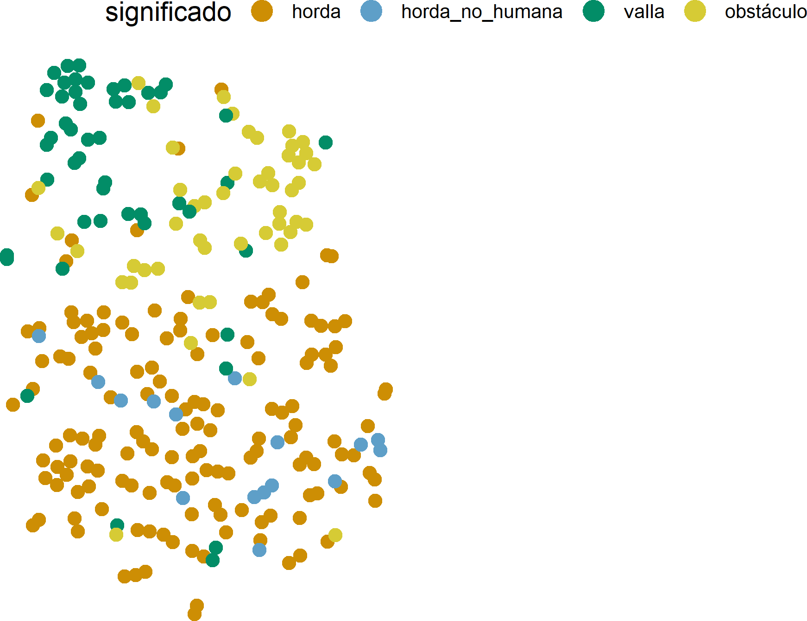
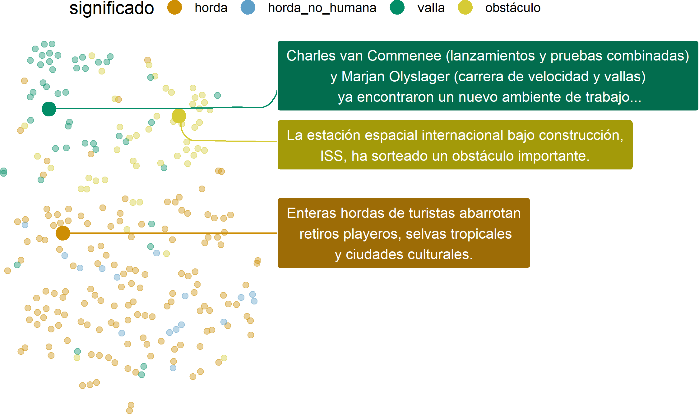
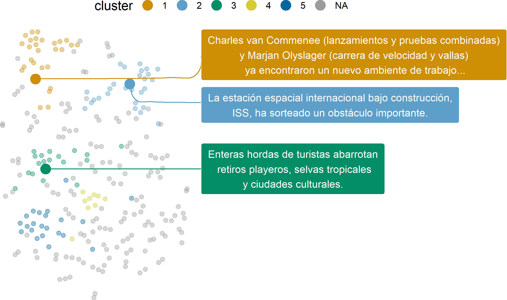
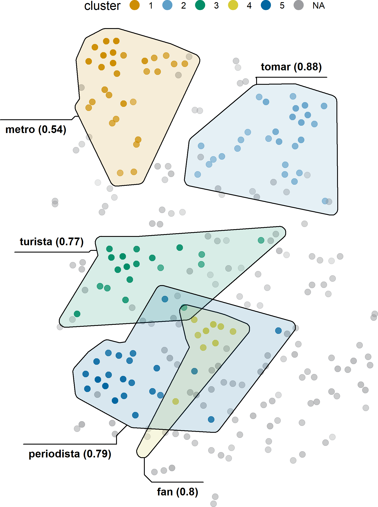

class: title-slide

```{r xaringanthemer, include=FALSE, warning=FALSE}
options(htmltools.dir.version = FALSE, readr.show_col_types = FALSE,
        knitr.kable.NA = 0)

library(xaringanthemer)
library(knitr); library(tidyverse)
library(icons)
library(kableExtra)

knitr::opts_chunk$set(
  # fig.height = 10
)

style_mono_accent(
  base_color = "#0266a0ff",
  colors = c(
    white = "#FFFFFF",
    gray = "#A9A9A9"
  ),
  title_slide_background_image = "img/cover.png",
  title_slide_background_color = "#FFFFFF",
  title_slide_text_color = "#0266a0ff"
  )
down_arrow <- icon_style(fontawesome("angle-double-down"), fill = "#0266a0")
ci <- icon_set("icons")

outline <- c(
  "Proyecto: Semántica nefológica",
  "Metodología: Modelos de espacios vectoriales",
  "Ejemplo: *horde* (NL)",
  "Conclusiones"
)

printOutline <- function(outline, highlight = double()) {
  if (length(highlight) > 0) {
    for (i in highlight) {
      outline[[i]] <- sprintf("**%s**", outline[[i]])
    }
    if (min(highlight) > 1) {
      for (i in 1:(min(highlight)-1)) {
        outline[[i]] <- sprintf(".gray[%s]", outline[[i]])
      }
    }
  }
  walk(paste("- ", outline, "\n\n"), cat)
}
```

```{r xaringanExtra, eval=require("xaringanExtra"), echo=FALSE, warning=FALSE}
library(xaringanExtra)
use_panelset()
#use_animate_css()
use_logo(
  image_url = "icons/cloud-qlvl-blue.png",
  width = "90px",
  link_url = "https://www.arts.kuleuven.be/ling/qlvl/projects/current/nephological-semantics"
)
use_tachyons()
use_share_again()
```

```{r metathis, echo=FALSE, warning=FALSE}
library(metathis)
meta() %>%
  meta_name("github-repo" = "montesmariana/maxipresentation") %>% 
  meta_social(
    title = "Investigando polisemia en corpus",
    description = paste(
      "Ponencia en AALiCo, Septiembre 2021"
    ),
    url = "https://montesmariana.github.io/maxipresentation/investigandopolisemia.html",
    image = "https://montesmariana.github.io/maxipresentation/investigando.png",
    image_alt = paste(
      "Portada de 'Investigando polisemia con corpus:", 
      "Límites y oportunidades.", 
      "Ponencia en AALiCo 2021, por Mariana Montes."
    ),
    og_type = "website",
    og_author = "Mariana Montes",
    twitter_card_type = "summary_large_image",
    twitter_creator = "@roblerobusto"
  )
```
```{r sourcecode, include=FALSE, code=readLines("R/presentations.R")}
```

.measure.mytitle[
# `r rmarkdown::metadata$title`

## `r rmarkdown::metadata$subtitle`

**`r rmarkdown::metadata$author`**

 

]

---
layout: true

.date-footnote[AALiCo XI, 10/09/2021]

---

# Contenidos

```{r, echo = FALSE, results="asis"}
printOutline(outline)
```

---

# Contenidos

```{r, echo = FALSE, results="asis"}
printOutline(outline, 1)
```

---

# Semántica nefológica

.center[Proyecto de investigación básica en KU Leuven]

--

### Miembros actuales

.pull-left[

- Dirk Geeraerts (director)

- Dirk Speelman

- Benedikt Szmrecsanyi

- Stefania Marzo

]

.pull-right[

- Kris Heylen

- Weiwei Zhang

- Karlien Franco

- Stefano De Pascale

- Mariana Montes

]

---

# Semántica nefológica

## Punto de partida

**Hipótesis Distribucional**: distribución similar `r icon_style(fontawesome("arrow-right"), fill = "#0266a0")` significado similar


.right[— Harris (1954); Firth (1957)]


- Las computadoras no tienen acceso al significado de un texto, pero sí a la distribución (=frecuencias) de sus elementos.

- ¿Podemos usar esa información para **representar relaciones semánticas**?

---

# Semántica nefológica

.pull-left[

### Objetivo

Comprender y desarrollar herramientas para métodos de semántica distribucional
- `r simple_icons("python")` Módulo de Python para crear espacios vectoriales

- `r simple_icons("d3dotjs")` Herramienta de visualización para explorar los resultados

- Casos, código y manual para explotar al máximo los datos: `r simple_icons("python")` + `r simple_icons("r")` + `r simple_icons("javascript")`
]
--

.pull-right[
### Subproyectos

- **Perspectiva semasiológica**

- Perspectiva onomasiológica

- Lectometría

]

---

# Subproyecto semasiológico

.bg-lightest-blue.b--dark-blue.ba.bw2.br3.shadow-5.mh5.center[
Métodos distribucionales aplicados al análisis de estructuras polisémicas.
]

<br>

- ¿(Cómo) podemos utilizarlos para **distinguir significados** automáticamente?


- ¿(Cómo) podemos refinarlos para identificar determinados **fenómenos semánticos**?

    + Por ejemplo: homonimia, metáfora, metonimia...

---

# Contenidos

```{r, echo = FALSE, results="asis"}
printOutline(outline, 2)
```

---
name: vsm-intro

# ¿Qué es un modelo de espacio vectorial?

.center[**vector** &rarr; lista de números]

```{r echo=FALSE}
vex <- read_delim("ejemplovectores.csv", delim = ";", locale = locale(decimal_mark = ",")) %>% 
  mutate_if(is.numeric, round, 2)

kable(slice(vex, 1), format.args = list(decimal.mark = ','))
```

--

<br> 
$$PMI_{(\mathrm{lingüística}, \mathrm{lenguaje})} = \log\frac{p(\mathrm{lingüística},\mathrm{lenguaje})}{p(\mathrm{lingüística})p(\mathrm{lenguaje})}$$

.footnote[
`r fontawesome("info-circle")`
Valores originales del [Corpus del Español](https://www.corpusdelespanol.org/web-dial/) con una ventana simétrica de 4 palabras a cada lado.

PMI: [Pointwise Mutual information](https://en.wikipedia.org/wiki/Pointwise_mutual_information)]

---
template: vsm-intro

<br>

$$PMI_{(\mathrm{lingüística}, \mathrm{lenguaje})} = \log\frac{121/N}{p(\mathrm{lingüística})p(\mathrm{lenguaje})}$$
---
template: vsm-intro

<br>

$$PMI_{(\mathrm{lingüística}, \mathrm{lenguaje})} = \log\frac{121/N}{\frac{14.587}{N}\frac{171.730}{N}}$$
---

template: vsm-intro

<br>

$$PMI_{(\mathrm{lingüística}, \mathrm{lenguaje})} = \log\frac{121}{14.587\times 171.730} N$$
---

template: vsm-intro

<br>

$$PMI_{(\mathrm{lingüística}, \mathrm{lenguaje})} = \log\frac{121}{14.587\times 171.730} N = 3,55$$
---

# Type-level: una palabra, un vector

- Cada fila es el vector de una palabra
   - agrupando datos de todas sus ocurrencias

- Cada columna es un elemento del contexto

```{r echo=FALSE, eval=require("kableExtra")}
kbl(vex, escape=FALSE, format.args = list(decimal.mark = ','))
```

---
name: study-tokens

# Token-level: una ocurrencia, un vector

### Ocurrencias de *estudiar*

(1) ¿Te gustaría **estudiar** el léxico del neerlandés?

(2) También **estudian** esto en lingüística computacional.

(3) Cuando **estudio** tomo mate y como chocolate.

<hr>

--

.center[(1) ¿Te gustaría **estudiar** el *léxico* del neerlandés?]

```{r, echo=FALSE, eval=require("kableExtra")}
vex %>% filter(nodo == "léxico") %>%
  rename(contexto = nodo) %>% kbl(format.args = list(decimal.mark = ','))
```

---
template: study-tokens

.center[(2) También **estudian** esto en *lingüística* *computacional*.]

```{r, echo=FALSE, eval=require("kableExtra")}
vex %>%
  filter(nodo %in% c("lingüística", "computacional")) %>%
  rename(contexto = nodo) %>% kbl(format.args = list(decimal.mark = ','))
```

---

### Fusión de vectores

.center[(2) También **estudian** esto en *lingüística* *computacional*.]

```{r, echo=FALSE, eval=require("kableExtra")}
vex %>%
  filter(nodo %in% c("lingüística", "computacional")) %>%
  rename(contexto = nodo) %>% kbl(format.args = list(decimal.mark = ','))
```

--
<br>

.center[
`r down_arrow`
`r down_arrow`
`r down_arrow`
`r down_arrow`
`r down_arrow`
]

<br>

```{r, echo=FALSE, eval=require("kableExtra")}
s2 <- vex %>%
  filter(nodo %in% c("lingüística", "computacional")) %>%
  select(-nodo) %>% colSums(na.rm = T) %>% as_tibble_row() %>% 
  mutate(nodo = "estudiar<sub>2</sub>") %>% 
  select(nodo, everything())
kbl(s2, escape=FALSE, format.args = list(decimal.mark = ','))

```

---

### Vectores de ocurrencias

.center[
.bb.b--gold.shadow-1.pv1.ph2[.gold.b[(1)] ¿Te gustaría **estudiar** el *léxico* del neerlandés?]

<br>
.bb.b--light-blue.shadow-1.pv1.ph2[.light-blue.b[(2)] También **estudian** esto en *lingüística* *computacional*.]

<br>
.bb.b--green.shadow-1.mt4.pv1.ph2[.green.b[(3)] Cuando **estudio** tomo *mate* y como *chocolate*.]

]

<br>

.center[
```{r, echo=FALSE, eval=require("kableExtra")}
tokvecs <- read_delim("ejemplotokens.csv", delim = ";", locale = locale(decimal_mark = ","))
tokvecs %>%
  kbl(escape = FALSE, format.args = list(decimal.mark = ',')) %>% 
  column_spec(1, color = colorblindr::palette_OkabeIto[1:3], bold=TRUE)
```
]

---

### Vectores de ocurrencias

.center[
.bb.b--gold.shadow-1.pv1.ph2[.gold.b[(1)] ¿Te gustaría **estudiar** el *léxico* del neerlandés?]

<br>
.bb.b--light-blue.shadow-1.pv1.ph2[.light-blue.b[(2)] También **estudian** esto en *lingüística* *computacional*.]

<br>
.bb.b--green.shadow-1.mt4.pv1.ph2[.green.b[(3)] Cuando **estudio** tomo *mate* y como *chocolate*.]

]

<br>

.center[
```{r, echo=FALSE, eval=require("kableExtra")}
tozero <- function(x) if (is.na(x) | x < 0) return ('0') else return (format(x, decimal.mark = ','))

alignment <- c('l', rep('r', length(tokvecs)-1)) %>% 
  paste(collapse = '')
tokvecs <- tokvecs %>% mutate(across(where(is.numeric), map_chr, tozero)) %>%
  mutate(across(-nodo, ~cell_spec(
    .x, color = if_else(.x == 0, "grey", "black")))) %>% 
  kbl(escape = FALSE, align = alignment) %>% 
  column_spec(1, color = colorblindr::palette_OkabeIto[1:3], bold=TRUE)
tokvecs
```
]

---

.pull-left[

#### Texto original

.gold.b[(1)] ¿Te gustaría **estudiar** el *léxico* del neerlandés?

.light-blue.b[(2)] También **estudian** esto en *lingüística* *computacional*.

.green.b[(3)] Cuando **estudio** tomo *mate* y como *chocolate*.

]


.pull-right[
#### Matriz entre ocurrencias y contextos

```{r, echo=FALSE, eval=require("kableExtra")}
tokvecs %>% kable_styling(font_size = 14)
```

]

--

.pull-left.dist[

#### Matriz de distancias entre ocurrencias

```{r, echo=FALSE, eval=require("kableExtra")}
reformat <- function(x) if (x == 0) '0' else format(x, decimal.mark = ',', digits = 3)
tdist <- read_delim("tokendist_es.csv", delim=";",
                  locale = locale(decimal_mark = ",")) %>% 
  select(token, everything()) %>% 
  mutate(across(where(is.numeric), ~round(1-.x, 3))) %>% 
  mutate(across(where(is.numeric), map_chr, reformat)) %>% 
  mutate(across(-token, ~cell_spec(.x, color = if_else(.x == '0', "grey", "black"))))
colnames(tdist) <- c("ocurrencia", tdist$token)
kable(tdist, escape = FALSE, align = 'lrrr') %>% 
  kable_styling(font_size = 16) %>% 
  column_spec(1, color = colorblindr::palette_OkabeIto[1:3], bold=TRUE)
```
]

--
.pull-right[
#### t-SNE: visualización
.halfsize[

]
]

---

# Contenidos

```{r, echo = FALSE, results="asis"}
printOutline(outline, 3)
```

---
# Ejemplo: *horde*

.br-pill.bg-dark-blue.ph3.pv1.white.b[horda]

*`r filter(ejemplos, significado == 'horda')$Dutch`*

`r filter(ejemplos, significado == 'horda')$Spanish`

.br-pill.bg-dark-blue.ph3.pv1.white.b[valla]

*`r filter(ejemplos, significado == 'valla')$Dutch`*

`r filter(ejemplos, significado == 'valla')$Spanish`

.br-pill.bg-dark-blue.ph3.pv1.white.b[obstáculo]
 
*`r filter(ejemplos, str_starts(significado, 'obst'))$Dutch`*

`r filter(ejemplos, str_starts(significado, 'obst'))$Spanish`

---

## Material

- `r nrow(df)` ocurrencias de *horde* en un corpus de periódicos de Flandes y los Países Bajos

    + 520 millones de palabras
    
    + textos escritos, periodísticos
    
    + 1999-2004
    
    + anotación automática: raíz, categoría gramatical, relaciones sintácticas

- Anotación manual con tres anotadores (alto nivel de acuerdo) y corrección.

--

## Expectativas

- Buena distinción entre homónimos

- Metáfora y especialización más difíciles de detectar que la homonimia

---

.left-column[
## Significados de *horde*
]

.right-column[

]

---

.left-column[
## Significados de *horde*
]

.right-column[

<br>


]

---

.left-column[
## HDBSCAN
]

.right-column[

<br>


]

---

.left-column[
## HDBSCAN
]

.right-column[

]

---

# Contenidos

```{r, echo = FALSE, results="asis"}
printOutline(outline, 4)
```

---

# Conclusiones

.bg-lightest-blue.shadow-2.pv1.ph2.center[
Los espacios vectoriales que modelan ocurrencias representan patrones colocacionales (textuales).
]

--

- Podemos distinguir significados *si coinciden con los patrones textuales*.

--

    + *meter* 'metro', *nemen* 'tomar', *journalist* 'periodista', *toerist* 'turista' co-occurren con determinados significados de *horde* 'horda/valla'

--

- Podemos identificar fenómenos semánticos *si coinciden con los patrones textuales*.

--

    + Metáfora (*de eerste horde nemen* 'sortear el primer obstáculo')

    + Usos (proto)típicos con enfoques diferentes (hordas de turistas *vs* hordas de periodistas)

---
layout: false
class: title-slide

.mythanks.center[

# ¡Muchas gracias!

[mariana.montes@kuleuven.be](mailto:mariana.montes@kuleuven.be)

`r icon_style(fontawesome("cloud-meatball"), fill="#0266a0")` [https://qlvl.github.io/NephoVis/](https://qlvl.github.io/NephoVis/)
]