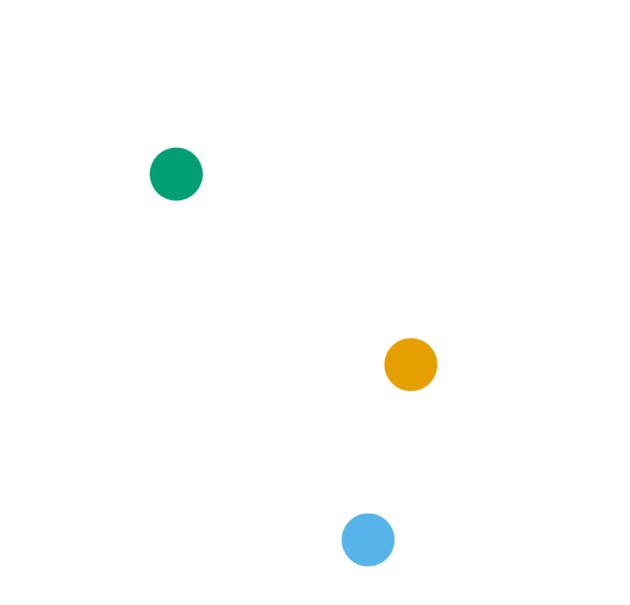

```{r xaringanthemer, include=FALSE, warning=FALSE}
options(htmltools.dir.version = FALSE)

library(xaringanthemer)
library(knitr); library(tidyverse)
library(icons)
library(kableExtra)

style_mono_accent(
  base_color = "#03763d",
  colors = c(
    white = "#FFFFFF",
    gray = "#A9A9A9"
  )
  )
down_arrow <- icon_style(fontawesome("angle-double-down"), fill = "#03763d")
ci <- icon_set("icons")

outline <- c(
  "Nephological Semantics project",
  "Vector space models",
  "Case studies",
  "Visualization tool",
  "Preliminary results",
  "Discussion"
)

printOutline <- function(outline, highlight = double()) {
  if (length(highlight) > 0) {
    for (i in highlight) {
      outline[[i]] <- sprintf("**%s**", outline[[i]])
    }
    if (min(highlight) > 1) {
      for (i in 1:(min(highlight)-1)) {
        outline[[i]] <- sprintf(".gray[%s]", outline[[i]])
      }
    }
  }
  walk(paste("- ", outline, "\n\n"), cat)
}
```

```{r xaringanExtra, eval=require("xaringanExtra"), echo=FALSE, warning=FALSE}
library(xaringanExtra)
use_panelset()
#use_animate_css()
use_logo(
  image_url = "icons/cloud-qlvl.png",
  width = "90px",
  link_url = "https://www.arts.kuleuven.be/ling/qlvl/projects/current/nephological-semantics"
)
use_tachyons()
use_share_again()
```

```{r metathis, echo=FALSE, warning=FALSE}
library(metathis)
meta() %>%
  meta_name("github-repo" = "montesmariana/maxipresentation") %>% 
  meta_social(
    title = "Cloud spotting",
    description = paste(
      "Visual analytics for distributional semantics.",
      "Seminar on PhD project at KU Leuven, March 2021."
    ),
    url = "https://montesmariana.github.io/maxipresentation/maxipresentation.html",
    image = "https://montesmariana.github.io/maxipresentation/social-card.png",
    image_alt = paste(
      "Title slide of Cloud spotting:", 
      "Visual analytics for distributional semantics.", 
      "Seminar on PhD project at KU Leuven, March 2021, by Mariana Montes."
    ),
    og_type = "website",
    og_author = "Mariana Montes",
    twitter_card_type = "summary_large_image",
    twitter_creator = "@roblerobusto"
  )
```

# Outline

```{r, echo = FALSE, results="asis"}
printOutline(outline)
```

---

# Outline

```{r, echo = FALSE, results="asis"}
printOutline(outline, 1)
```

---

# Nephological Semantics

.center[C1 project (KU Leuven)]

--

### Current members
.pull-left[
- Dirk Geeraerts (PI)
- Dirk Speelman
- Benedikt Szmrecsanyi
- Stefania Marzo

]

.pull-right[

- Kris Heylen
- Weiwei Zhang
- Karlien Franco
- Stefano De Pascale
- Mariana Montes

]

---

# Nephological Semantics

### Goal

Understand and develop tools for distributional semantics
- `r simple_icons("python")` Python module to create count-based token-level vector space models

- `r simple_icons("d3dotjs")` Visualization tool for exploration 

- Case studies, code and manual to make the most of our data: `r simple_icons("python")` + `r simple_icons("r")` + `r simple_icons("javascript")`

### Work packages

- Lectometry

- Onomasiology

- **Semasiology**

---

# Semasiological work package

<!-- .center[(where this PhD is inserted)] -->

### Using distributional semantics to study polysemy

- Which models perform best?

E.g. *Models that use a window size of 10 and exclude prepositions are the best at disambiguating senses.*

- How do the models handle granularity of meaning?

E.g. *A good window size is enough to distinguish homonyms, but PMI weighting is necessary to distinguish senses within a homonym.*

- ...and more!

---

# Outline

```{r, echo = FALSE, results="asis"}
printOutline(outline, 2)
```

---
name: vsm-intro

# What are vector space models?

.center[**word vectors** &rarr; numerical representations of words]

```{r echo=FALSE}
vex <- read_csv("data/vectorexample.csv", show_col_types = F) %>%
  select(target, `language/n`, `word/n`, `english/j`, `speak/v`, everything()) %>% 
  mutate_if(is.numeric, round, 2)

kable(slice(vex, 1))
```

--

<br> 
$$PMI_{(linguistics, language)} = \log\frac{p(linguistics, language)}{p(linguistics)p(language)}$$

.footnote[
`r fontawesome("info-circle")`
Actual values from GloWbE (Global Web-based English corpus), with a window-span of 10 words to either side.

PMI: [Pointwise Mutual information](https://en.wikipedia.org/wiki/Pointwise_mutual_information)]

---
template: vsm-intro

<br>

$$PMI_{(linguistics, language)} = \log\frac{\frac{285}{N}}{p(linguistics)p(language)}$$
---
template: vsm-intro

<br>

$$PMI_{(linguistics, language)} = \log\frac{\frac{285}{N}}{\frac{20,740}{N}\frac{1.58 \times 10^6}{N}}$$
---

template: vsm-intro

<br>

$$PMI_{(linguistics, language)} = \log\frac{285}{20,740\times 1.58 \times 10^6} N$$
---

template: vsm-intro

<br>

$$PMI_{(linguistics, language)} = \log\frac{285}{20,740\times 1.58 \times 10^6} 9.14 \times 10^8$$
---
template: vsm-intro

<br>

$$PMI_{(linguistics, language)} = \log\frac{285}{20,740\times 1.58 \times 10^6} 9.14 \times 10^8 = 4.37$$
---

# Type level vectors

- Each row is the vector of a word
   - aggregating over all its occurrences

- Each column is a context feature

```{r echo=FALSE, eval=require("kableExtra")}
kbl(vex, escape=FALSE)
```

---
name: study-tokens

# Token level vectors

### Tokens of *to study*

(1) Would you like to **study** linguistics?

(2) They **study** this in computational linguistics too.

(3) I eat chocolate while I **study**.

<hr>

--

.center[(1) Would you like to **study** *linguistics*?]

```{r, echo=FALSE, eval=require("kableExtra")}
vex %>% filter(target == "linguistics/n") %>%
  rename(`context feature` = target) %>% kbl()
```

---
template: study-tokens

.center[(2) They **study** this in *computational linguistics* too.]

```{r, echo=FALSE, eval=require("kableExtra")}
vex %>%
  filter(target %in% c("linguistics/n", "computational/j")) %>%
  rename(`context feature` = target) %>% kbl()
```

---

### Merging vectors

.center[(2) They **study** this in *computational linguistics* too.]

```{r, echo=FALSE, eval=require("kableExtra")}
vex %>%
  filter(target %in% c("linguistics/n", "computational/j")) %>%
  rename(`context feature` = target) %>% kbl()
```

--
<br>

.center[
`r down_arrow`
`r down_arrow`
`r down_arrow`
`r down_arrow`
`r down_arrow`
]

<br>

```{r, echo=FALSE, eval=require("kableExtra")}
s2 <- vex %>%
  filter(target %in% c("linguistics/n", "computational/j")) %>%
  select(-target) %>% colSums() %>% as_tibble_row() %>% 
  mutate(target = "study<sub>2</sub>") %>% 
  select(target, everything())
kbl(s2, escape=FALSE)

```

---

### Token level vectors

.center[
.bb.b--gold.shadow-1.pv1.ph2[.gold.b[(1)] Would you like to **study** *linguistics*?]

<br>
.bb.b--light-blue.shadow-1.pv1.ph2[.light-blue.b[(2)] They **study** this in *computational linguistics* too.]

<br>
.bb.b--green.shadow-1.mt4.pv1.ph2[.green.b[(3)] I eat *chocolate* while I **study**.]

]

<br>

.center[
```{r, echo=FALSE, eval=require("kableExtra")}
read_csv("data/tokensexample.csv", show_col_types = F) %>%
  kbl(escape = FALSE) %>% 
  column_spec(1, color = colorblindr::palette_OkabeIto[1:3], bold=TRUE)
```
]

---

.pull-left[

#### Original text

.gold.b[(1)] Would you like to **study** *linguistics*?

.light-blue.b[(2)] They **study** this in *computational linguistics* too.

.green.b[(3)] I eat *chocolate* while I **study**.

]


.pull-right[
#### Token-context matrix

```{r, echo=FALSE, eval=require("kableExtra")}
read_csv("data/tokensexample.csv", show_col_types = F) %>%
  kbl(escape = FALSE) %>% 
  kable_styling(font_size = 11) %>% 
  column_spec(1, color = colorblindr::palette_OkabeIto[1:3], bold=TRUE)
```

]

--

.pull-left.dist[

#### Token-token distance matrix
```{r, echo=FALSE, eval=require("kableExtra")}
tdist <- read_csv("data/tokendist.csv", show_col_types = F) %>% 
  select(token, everything()) %>% 
  mutate_if(is.numeric, ~1-.x) %>% 
  mutate_if(is.numeric, ~cell_spec(.x, color = if_else(.x == 0, "grey", "black")))
colnames(tdist) <- c("target", tdist$token)
kbl(tdist, escape = FALSE) %>% 
  column_spec(1, color = colorblindr::palette_OkabeIto[1:3], bold=TRUE)
```
]

--
.pull-right[
#### t-SNE visualization
.halfsize[

]
]

---
class: center

# In short

.ba.br3.bw1.shadow-3.b--dark-green.bg-washed-green[
We represent a word

.i[(types and tokens)]

with its (textual) context.
]

--

# BUT

### How do you define the context?

---
class: center

# Parameter settings

.pull-left[
### First order

<!-- `r fontawesome("arrow-alt-circle-down")` -->

The context of each token

.panelset[

  .panel[.panel-name[i]
  Would you like to **study** *linguistics*? It's so cool!
  ]
  
  .panel[.panel-name[ii]
  Would you *like* to **study** *linguistics*? It's so *cool*!
  ]
  
  .panel[.panel-name[iii]
  *Would* you *like* to **study** linguistics? It'*s* so cool!
  ]
  
  .panel[.panel-name[iv]
  *Would you like to* **study** *linguistics*? It's so cool!
  ]
  
  .panel[.panel-name[...]
  ~~Would you like to **study** linguistics? It's so cool!~~
  ]
]

]

<!-- -- -->

.pull-right[
### Second order

<!-- `r fontawesome("arrow-alt-circle-down")` -->

The context of the context

.panelset[

  .panel[.panel-name[I]
  *PMI window: 10; all words*
  
```{r, echo=FALSE}
kbl(vex, escape=FALSE) %>% 
  kable_styling(font_size = 9)
```

  ]
  
  .panel[.panel-name[II]
  *PMI window: 10; no adjectives*
  
```{r, echo=FALSE}
kbl(select(vex, -ends_with("j")), escape=FALSE) %>% 
  kable_styling(font_size = 9)
```

  ]
  
  .panel[.panel-name[III]
  *PMI window: 4; all words*
  
```{r, echo=FALSE}
# This one is with a window size of 4 instead of 10 (I think)
read_csv("data/vectorexample2.csv", show_col_types = F) %>%
  select(target, `language/n`, `word/n`, `english/j`, `speak/v`, everything()) %>% 
  mutate_if(is.numeric, round, 2) %>% 
  kbl(escape=FALSE) %>% 
  kable_styling(font_size = 9)
```
  ]
  
  .panel[.panel-name[IV]
  *PMI window:10; same columns as rows*
  
```{r, echo=FALSE}
# Again window size of 10 but same cols as rows
vexFoc <- read_csv("data/vectorexample3.csv", show_col_types = F) %>% 
  filter(target != "lexicography/n")
select(vexFoc, target, vexFoc$target) %>% 
  mutate_if(is.numeric, round, 2) %>% 
  kbl(escape=FALSE) %>% 
  kable_styling(font_size = 9)
```
  ]
]
]

---
class: center

.pull-left[
### First order
```{r, echo=FALSE, eval=require("kableExtra")}
DiagrammeR::grViz("data/context.gv")
```
]
--

.pull-right[
### Second order
```{r, echo=FALSE, eval=require("kableExtra")}
DiagrammeR::grViz("data/socontext.gv")
```
]

---

# Outline

```{r, echo = FALSE, results="asis"}
printOutline(outline, 3)
```

---

## 32 Dutch nouns, verbs and adjectives

<br>

```{r, echo=FALSE, eval=require("kableExtra")}
joinList <- function(x) paste0(x, collapse = "<br>")
tibble(
  nouns = joinList(c("blik", "hoop", "horde", "schaal", "spot", "staal", "stof")),
  verbs1 = joinList(c("diskwalificeren", "haken", "harden", "haten", "heffen", "helpen")),
  verbs2 = joinList(c("herhalen", "herinneren", "herroepen", "herstellen", "herstructureren", "huldigen")),
  adjs1 = joinList(c("dof", "geestig", "gekleurd", "geldig", "gemeen", "goedkoop", "grijs")),
  adjs2 = joinList(c("hachelijk", "heet", "heilzaam", "hemels", "hoekig", "hoopvol"))
) %>% 
  kable(escape = FALSE, col.names = NULL) %>% 
  add_header_above(
    c("7 nouns", "12 verbs" = 2, "13 adjectives" = 2)
  )

```

---

# Semantic annotation

1. Assign a sense from a simplified set

1. If no sense could be assigned, explain why

1. Indicate which context words helped the decision


.halfsize.shadow-5.center[

]

---

# Outline

```{r, echo = FALSE, results="asis"}
printOutline(outline, 4)
```

---

# Visualization tool

- Written in Javascript with [`r ci$d3`](https://d3js.org/) (and other libraries)

- Originally designed by [Thomas Wielfaert](http://tokenclouds.github.io/LeTok/)

- Further developed by [me](https://github.com/qlvl/NephoVis)

- Three levels of scatterplots to examine and compare models

<br>

.center[
*Not really ready for deployment yet, but you can [play](https://qlvl.github.io/NephoVis/)!*
]

---

# [Visualization tool](https://qlvl.github.io/NephoVis/level1.html?type=hachelijk)


---

# Outline

```{r, echo = FALSE, results="asis"}
printOutline(outline, 5)
```

---

## Best models?

.panelset[

.panel[.panel-name[Best 'hoop' model]
  .pull-left[
  .center[**hoop** 'hope, heap']
  
  ]

  .pull-right[
  .center[**stof** 'substance, fabric, dust']
  
  ]

]

.panel[.panel-name[Best 'stof' model]
  .pull-left[
  .center[**hoop** 'hope, heap']
  
  ]

  .pull-right[
  .center[**stof** 'substance, fabric, dust']
  
  ]

]

.panel[.panel-name[Range]
.pull-left[
.center[**Hoop** 'hope, heap']

]

.pull-right[
.center[**Schaal** 'scale, dish']

]
]

]

--

???

Best *hoop* : LEMMAPATHweight.PPMIno.LENGTHFOC.SOCPOSall

Best *stof* : BOWbound5lex.PPMIselection.LENGTHFOC.SOCPOSall

---

### What parameters make the most difference?

.pull-left[
.center[**Hachelijk** 'dangerous, critical']

]

.pull-right[
.center[**Geldig** 'valid']

]


.footnote[Color: Part of speech filters (**, , **)]

---

# Outline

```{r, echo = FALSE, results="asis"}
printOutline(outline, 6)
```

---

# Discussion

.bg-washed-green.shadow-2.pv1.ph2.center[
No set of parameters identifies "senses" reliably, across the board.
]

- Not even within part-of-speech.

- Unrelated to number of senses.

--

.bg-washed-green.shadow-2.pv1.ph2.center[
Vector space models identify collocational patterns

which may or may not match "senses".
]

- Are there strong, recurrent patterns?

- Are they very different from each other?

- Are they driven by more lexical or syntactic items?

???

Discrete senses are an abstraction and don't exist in the wild.

---

# What is all this for?

.center.ttc.f3[
Guidelines for

**Corpus-based semasiological research**]

- Does it work? How?

- What can you expect and how do you get it?

- How to interpret basic shapes?

- Parameters you should definitely include (e.g. part-of-speech filters)

- Parameters you can forget about (e.g. very long vectors)

--

- Is it worth all the trouble?

---
class: inverse, center, middle

# Thank you!

.bg-white.br4.pv1[

[mariana.montes@kuleuven.be](mailto:mariana.montes@kuleuven.be)

`r icon_style(fontawesome("cloud-meatball"), fill="#03763d")` [https://qlvl.github.io/NephoVis/](https://qlvl.github.io/NephoVis/)
]